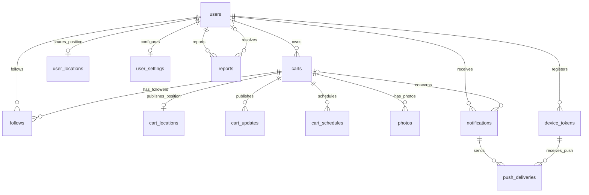

# Database Table Schemas

Schema documentation for all **23 tables**, based on the migrated MySQL database and checked against the repository migrations on 2026-09-13. Each table document lists its columns, exact MySQL types, defaults, indexes, foreign keys, deletion behavior, and CREATE TABLE statement. No application records or credentials are included.

- [Schema-only SQL reference](schema.sql)
- [API documentation](../api.md)
- [System design](../system-design.md)
- Source of truth for changes: `database/migrations/`.

## Table index

| Table | Purpose |
|---|---|
| [users](users.md) | Customer, owner, and administrator accounts. |
| [carts](carts.md) | Cart profiles and ownership. |
| [cart_locations](cart_locations.md) | One latest GPS position per cart. |
| [user_locations](user_locations.md) | One latest GPS position per customer. |
| [user_settings](user_settings.md) | Per-account notification and proximity preferences. |
| [follows](follows.md) | Persistent user/cart follow relationships. |
| [cart_updates](cart_updates.md) | Published announcements and activity events. |
| [cart_schedules](cart_schedules.md) | Weekly serving windows and dated one-off stops. |
| [photos](photos.md) | References to uploaded photo files. |
| [device_tokens](device_tokens.md) | Registered Firebase Messaging tokens for user devices. |
| [notifications](notifications.md) | Persistent per-user inbox messages. |
| [push_deliveries](push_deliveries.md) | Separate delivery and retry state for each notification/device pair. |
| [reports](reports.md) | User-submitted reports and administrator resolutions. |
| [settings](settings.md) | Application-wide key/value configuration. |
| [personal_access_tokens](personal_access_tokens.md) | Laravel Sanctum bearer token records. |
| [password_reset_tokens](password_reset_tokens.md) | Framework table reserved for password reset tokens. |
| [sessions](sessions.md) | Database-backed administrator browser sessions. |
| [cache](cache.md) | Laravel cache entries when CACHE_STORE=database. |
| [cache_locks](cache_locks.md) | Shared locks when using the database cache store. |
| [jobs](jobs.md) | Standard Laravel database queue jobs. |
| [job_batches](job_batches.md) | Standard Laravel job batch tracking. |
| [failed_jobs](failed_jobs.md) | Failures from the standard Laravel queue. |
| [migrations](migrations.md) | Laravel schema migration bookkeeping. |

## Relationships

The diagram shows database-enforced relationships for application tables. `||` means exactly one, `o|` zero or one, and `o{` zero or many. Logical polymorphic references are listed separately below.



`reports.target_type/target_id` references a cart or user through application validation, without a database foreign key. Sanctum's `personal_access_tokens.tokenable_type/tokenable_id` is also polymorphic without a foreign key. `sessions.user_id` has an index but no foreign key. These distinctions matter when deleting accounts and records.

## Reading the schemas

- MySQL booleans are `tinyint(1)`; application validation determines allowed boolean input.
- `None` means no declared column default. `NULL` is the default for a nullable field. AUTO_INCREMENT IDs are database-generated.
- Laravel `created_at` and `updated_at` columns are nullable timestamps populated by Eloquent, not automatic database timestamp defaults/triggers.
- Columns may permit more than the API accepts: for example VARCHAR(255) names may have a 100-character API limit. Status/role choices and coordinate bounds are validated in application code, not SQL enums/CHECK constraints.
- All captured tables use InnoDB and utf8mb4_unicode_ci. Server/database connection settings may change defaults for future migrations.
- Foreign-key cascades remove database rows; they do not delete uploaded files. Application cart/photo deletion handles file cleanup.
- `cart_schedules` does not have a unique cart/weekday/date constraint. The existing upsert logic is an application convention.
- `settings` holds application preferences. MySQL connection values are configured in `.env` through `config/mysql.php`.

## Inspect the running schema

```bash
docker compose exec app php artisan migrate:status
docker compose exec app php artisan db:table carts
```

These documents are a snapshot. Update them after schema migrations; do not import schema.sql into an existing database as a migration replacement.
