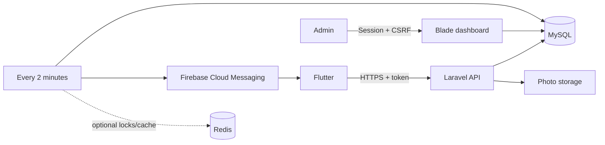

# System design and suggested improvements

## Initial design

A Laravel monolith keeps operations simple: one MySQL database, a Blade admin UI, Sanctum API tokens, public photo storage, and one scheduler. Redis is optional for locks/cache. Firebase is used only as the push transport.



User/cart locations are single current-position rows, with server timestamps. Nearby relationships are computed from distance and freshness rather than persisting a growing user-by-cart cross product. Follows have one unique user/cart pair and an explicit flag; cart owner ID comes from the cart relation. A follower's own configuration controls update and proximity delivery.

Cart updates are durable events. The dispatcher records one inbox notification per recipient and one push-delivery row per device. Unique deduplication keys and transactional fanout make reruns safe. A shared cache lock serializes dispatchers; a crash releases the lock after expiry. Delivery retries use exponential backoff with a five-attempt limit. The dashboard supports retry of failed records. Push sends are at least once: a crash after FCM accepts a message but before MySQL records success can duplicate it. Mobile deduplication is required.

Push-disabled mode retains pending deliveries. Enabling push later sends eligible backlog; review it first if a long outage makes old messages undesirable. In-app inboxes are durable even when a user opts out of push. Followers added after an update do not get that historical push, but can read the existing activity feed. Unfollowing or disabling the account/preferences before delivery causes pending sends to be skipped.

## Priority improvements before a public launch

1. **Identity and administration:** Add email verification, password-reset delivery, administrator MFA, owner application/approval workflow, and append-only moderation audit records with reason/actor/old/new values. Current user blocking is enforced immediately but does not preserve a detailed blocking history.
2. **Media privacy and moderation:** Current files are public and their URLs remain reachable even if a cart is hidden. For takedown guarantees use private object storage plus authorized/signed delivery, and purge caches on moderation. Re-encode uploads to strip GPS EXIF metadata, produce thumbnails, and scan uploads. Add quotas per owner and transactional photo-limit enforcement under concurrency.
3. **Location privacy:** Define consent, retention, and account deletion policies. The initial system retains only the latest location and prunes user locations after 24 hours. Restrict precise user-location dashboard access to a dedicated permission once the team grows.
4. **Notification freshness:** Expire stale nearby deliveries, add quiet hours, per-day limits, and geofence entry/exit hysteresis. The current ten-minute cooldown can notify again while a customer stays near a cart. Choose whether that is desirable. Separate notification kinds in the inbox if richer UI badges are needed.
5. **Scale:** The initial radius query uses a latitude bounding filter followed by Haversine distance in PHP. Add MySQL spatial POINT/SRID indexes and database-side exact distance with pagination when the catalog grows. Nearby fanout iterates active users and followed carts; benchmark before thousands of concurrent users.
6. **Workers and fanout:** Large fanouts currently run in a transaction per cart update. Split into bounded recipient jobs with durable cursors and a transactional outbox when needed. Cap wall time, measure dispatch lag, and add health metrics. Keep a single shared lock store and scheduler until durable work-claim semantics replace serialization.
7. **Real-time UX:** Start with foreground polling and push-triggered refresh. Add WebSockets/SSE only when justified. Owner GPS needs throttling, adaptive sampling, battery-aware foreground/background handling, and detection of implausible jumps.
8. **Operational readiness:** TLS termination, secret rotation, least-privilege DB accounts, encrypted backups with tested restoration, alerting on failed deliveries/queue age, disk monitoring, and separate staging/production Firebase projects. Laravel's development server and the supplied bind-mounted Compose stack are for local development.
9. **API evolution:** Introduce API resources and an OpenAPI contract if multiple client versions need long-term compatibility. Add atomic schedule-list replacement, optimistic concurrency for admin edits, and idempotency keys for owner announcement creation. The current schedule upsert is not protected by a unique constraint for nullable one-off dates under concurrent requests.

## Tradeoffs

No Redis dependency is required at launch; database cache locks add modest DB load. API responses are not cached initially so moderation and privacy changes take effect immediately. Credentials belong in deployment secrets, not dashboard editable text fields. Global cache/provider changes require a deliberate environment change and process restart.

The dashboard manages domain records through allowlisted fields, rather than exposing arbitrary SQL. Some records are intentionally read-only (inboxes, delivery history, customer positions); location deletion and delivery retries are explicit operations. User/cart accounts are deactivated or moderated rather than deleted from the dashboard; the owner API can delete its own cart.

## GPS retention decision: current position only

`cart_locations` stores one current row per cart, not an append-only GPS log:

```text
cart_id       UNIQUE foreign key to carts.id
latitude      current latitude
longitude     current longitude
recorded_at   latest server receipt time for a location save
updated_at    row modification time / indexed freshness check
```

The existing id, address, and created_at columns remain. Each GPS PUT upserts by cart_id and overwrites the previous position, including refreshing timestamps when stationary. GPS writes do not automatically append cart_updates. Client timestamps cannot set freshness. Existing records receive recorded_at from their historical updated_at/created_at during migration, preserving age.

If historical route analytics are needed later, introduce a separate sampled history store with an explicit retention/expiry policy. Do not turn the current-location table into an unlimited event log. User locations also remain one current row per user; this change adds recorded_at only to cart locations.
