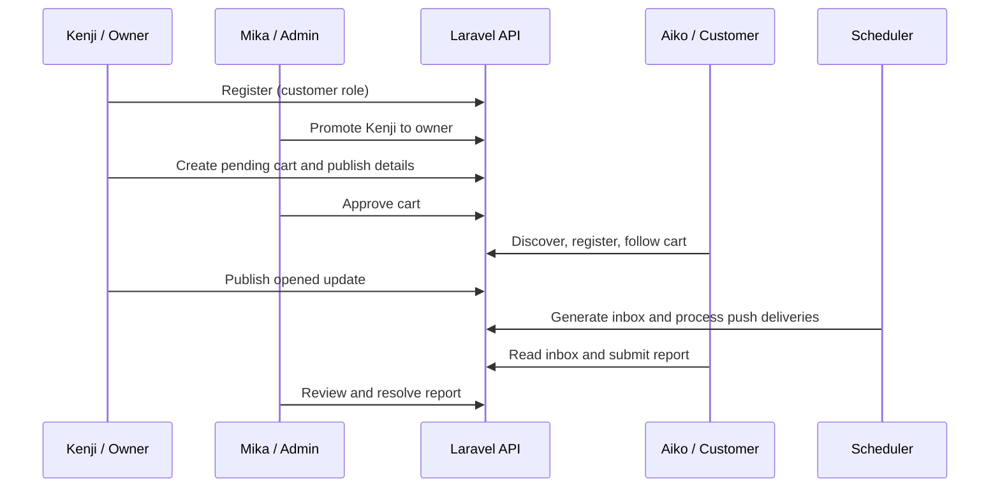

# User Journeys with API Examples

Follow one shared story: **Aiko Tanaka** discovers and follows **Kenji Sato's Tokyo Taco Club**, while **Mika Admin** approves the owner/cart and handles reports.

| Journey | What it covers |
|---|---|
| [Normal user / customer](normal_user/README.md) | Browse, register, locate, follow, preferences, notifications, reporting, and logout |
| [Cart owner](cart_owner/README.md) | Register, obtain owner access, create a cart, publish GPS/photos/schedules/updates, close, and logout |
| [Administrator](admin/README.md) | Bootstrap admin access, promote owners, approve carts, investigate reports, and manage account access |

## Before starting

Run examples from the repository root with the backend started and migrated. These are walkthroughs, not scripts that have been executed against your live data. Use disposable development accounts. Example names, emails, and passwords are invented and are not preconfigured logins.

```bash
export BASE_URL=http://localhost:8000
```

BASE_URL excludes `/api/v1`. Run each role in a separate terminal and copy actual tokens/IDs from responses into the variables shown. `curl -i` displays both status and body. JSON response snippets are excerpts; generated IDs and timestamps vary. All calls use the current versioned API and JSON authentication, not browser session authentication.

## Shared sequence

1. Mika creates an administrator account using the CLI and signs in to the API.
2. Kenji registers as a customer. Mika promotes that account to owner.
3. Kenji creates Tokyo Taco Club, publishes its location/photo/schedule, and Mika approves it.
4. Aiko browses, registers, enables preferences, publishes her location, and follows the cart.
5. Kenji opens the cart and publishes an activity update **after Aiko follows**.
6. The server scheduler generates the inbox notification. Aiko reads it and optionally submits a report.
7. Mika reviews the report and resolves it, optionally taking down a cart or blocking an account.



## Common behavior

- Registration returns 201 and creates only a customer. Login returns 200; returned tokens expire after 30 days.
- Replace `$CUSTOMER_TOKEN`, `$OWNER_TOKEN`, and `$ADMIN_TOKEN` with tokens from that role's response. Never use an admin token in a customer's mobile session.
- Lists return `data` plus pagination metadata; request `?page=2` when another page exists.
- Missing/expired token: 401. Insufficient role or disabled authenticated account: 403. Missing/hidden resource: 404. Invalid fields: 422. Rate limit: 429; wait for the indicated retry/window before trying again.
- API IDs are numeric. Do not reuse IDs from a different database or assume sample records exist.
- The backend does not collect device GPS. Mobile permission prompts and coordinate publication must be implemented by the client.
- Push is disabled until FCM credentials and a real device token are configured. In-app inboxes work without FCM. The scheduler must run to generate notifications.
- Owner field changes do not automatically generate activity messages; publish a separate update when followers should be notified.

See [API reference](../api.md), [per-endpoint parameter/test examples](../test/README.md), and [database schema](../db/README.md) for details.
