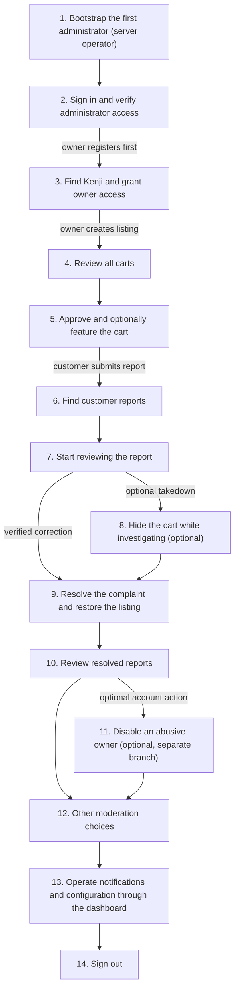

# Administrator Journey — Approve and Moderate the Community

[All journeys](../README.md) · Role: `admin` · Example person: **Mika Admin** (`mika@example.test`).

Mika approves Kenji's owner access and cart, then investigates Aiko's report. Keep privileged tokens on the administrator client. The examples use the REST API; the browser dashboard uses separate session/CSRF authentication.

```bash
export BASE_URL=http://localhost:8000
```

## 1. Bootstrap the first administrator (server operator)

There is no public API that creates the first admin. An authorized server operator runs:

```bash
docker compose exec app php artisan app:create-admin mika@example.test --name="Mika Admin"
```

The command prompts privately for a password of at least 12 characters. For this disposable walkthrough only, the subsequent example assumes `Journey-Mika-2026!`; use the password actually entered. If the administrator already exists, skip creation. The CLI is not a mobile API.

## 2. Sign in and verify administrator access

Use the administrator credentials created above.

**API:** `POST /api/v1/auth/login`

```bash
curl -i -X POST "$BASE_URL/api/v1/auth/login" \
  -H 'Accept: application/json' \
  -H 'Content-Type: application/json' \
  --data '{"email":"mika@example.test","password":"Journey-Mika-2026!"}'
```

**Expected:** 200 with `user.role: admin` and a bearer token.

```bash
export ADMIN_TOKEN='<token returned by administrator login>'
```
```bash
curl -i -X GET "$BASE_URL/api/v1/me" \
  -H 'Accept: application/json' \
  -H "Authorization: Bearer $ADMIN_TOKEN"
```

**Expected:** 200 with Mika’s account. Customer/owner tokens cannot call the admin endpoints.

## 3. Find Kenji and grant owner access

After Kenji registers, search users by name. Search does not match email. Verify the returned email before modifying the account.

**API:** `GET /api/v1/admin/users?search=Kenji&page=1`

```bash
curl -i -X GET "$BASE_URL/api/v1/admin/users?search=Kenji&page=1" \
  -H 'Accept: application/json' \
  -H "Authorization: Bearer $ADMIN_TOKEN"
```

**Expected:** 200 with matching users. Copy Kenji’s actual ID, not Mika’s.

```bash
export OWNER_USER_ID=201 # Replace with Kenji’s returned user ID.
```
```bash
curl -i -X PATCH "$BASE_URL/api/v1/admin/users/$OWNER_USER_ID" \
  -H 'Accept: application/json' \
  -H "Authorization: Bearer $ADMIN_TOKEN" \
  -H 'Content-Type: application/json' \
  --data '{"role":"owner","is_active":true}'
```

**Expected:** 200; Kenji now has role=owner and can create his cart. Send him back to owner step 3.

## 4. Review all carts

After Kenji creates the cart and adds details, inspect the listings. The API returns all moderation states; filter pending items in the client because this path has no status query filter.

**API:** `GET /api/v1/admin/carts?page=1`

```bash
curl -i -X GET "$BASE_URL/api/v1/admin/carts?page=1" \
  -H 'Accept: application/json' \
  -H "Authorization: Bearer $ADMIN_TOKEN"
```

**Expected:** 200 with cart details, including pending carts and related locations, photos, and schedules. Match owner_id to Kenji and name to Tokyo Taco Club.

```bash
export CART_ID=401 # Replace with Kenji’s cart ID from the response.
```

## 5. Approve and optionally feature the cart

Approve the reviewed listing. Featuring is an independent administrator choice.

**API:** `PATCH /api/v1/admin/carts/$CART_ID`

```bash
curl -i -X PATCH "$BASE_URL/api/v1/admin/carts/$CART_ID" \
  -H 'Accept: application/json' \
  -H "Authorization: Bearer $ADMIN_TOKEN" \
  -H 'Content-Type: application/json' \
  --data '{"moderation_status":"approved","is_featured":true}'
```

**Expected:** 200. The cart becomes publicly discoverable as long as its owner remains active; nearby discovery additionally needs fresh GPS data.
```bash
curl -i -X GET "$BASE_URL/api/v1/carts/$CART_ID" \
  -H 'Accept: application/json'
```

**Expected:** 200. Kenji can now publish updates, and Aiko can follow.

## 6. Find customer reports

After Aiko submits her report, open the moderation queue.

**API:** `GET /api/v1/admin/reports?status=open&page=1`

```bash
curl -i -X GET "$BASE_URL/api/v1/admin/reports?status=open&page=1" \
  -H 'Accept: application/json' \
  -H "Authorization: Bearer $ADMIN_TOKEN"
```

**Expected:** 200 with open reports. Locate the report for this cart and record its actual ID. An empty list means no matching report exists yet.

```bash
export REPORT_ID=801 # Replace with the returned report ID.
```

## 7. Start reviewing the report

Record that Mika is investigating the location complaint.

**API:** `PATCH /api/v1/admin/reports/$REPORT_ID`

```bash
curl -i -X PATCH "$BASE_URL/api/v1/admin/reports/$REPORT_ID" \
  -H 'Accept: application/json' \
  -H "Authorization: Bearer $ADMIN_TOKEN" \
  -H 'Content-Type: application/json' \
  --data '{"status":"reviewing","resolution_note":"Checking the published location with the owner."}'
```

**Expected:** 200 with status=reviewing, resolved_by=Mika’s ID, and resolved_at=null. The actor is derived from the token.

## 8. Hide the cart while investigating (optional)

If the complaint warrants a temporary takedown, set it pending and remove featured status. This is an optional moderation branch.

**API:** `PATCH /api/v1/admin/carts/$CART_ID`

```bash
curl -i -X PATCH "$BASE_URL/api/v1/admin/carts/$CART_ID" \
  -H 'Accept: application/json' \
  -H "Authorization: Bearer $ADMIN_TOKEN" \
  -H 'Content-Type: application/json' \
  --data '{"moderation_status":"pending","is_featured":false}'
```

**Expected:** 200. Public GET /carts/{cart} now returns 404 and it is excluded from public lists. Kenji still sees his own cart in /owner/carts but cannot publish activity until approval.

Known public photo URLs remain accessible after hiding a cart; moderation currently hides the listing rather than revoking file URLs.

## 9. Resolve the complaint and restore the listing

After Kenji refreshes the GPS location and Mika verifies it, approve the cart again.

**API:** `PATCH /api/v1/admin/carts/$CART_ID`

```bash
curl -i -X PATCH "$BASE_URL/api/v1/admin/carts/$CART_ID" \
  -H 'Accept: application/json' \
  -H "Authorization: Bearer $ADMIN_TOKEN" \
  -H 'Content-Type: application/json' \
  --data '{"moderation_status":"approved","is_featured":false}'
```

**Expected:** 200. The listing is visible again if the owner is active.
```bash
curl -i -X PATCH "$BASE_URL/api/v1/admin/reports/$REPORT_ID" \
  -H 'Accept: application/json' \
  -H "Authorization: Bearer $ADMIN_TOKEN" \
  -H 'Content-Type: application/json' \
  --data '{"status":"resolved","resolution_note":"Owner updated the location to Tokyo station plaza; verified and restored the listing."}'
```

**Expected:** 200 with status=resolved, resolved_by=Mika’s ID, and a server-generated resolved_at. For an unfounded complaint, use dismissed instead; to reopen, use open (clears resolved_at).

## 10. Review resolved reports

Confirm the case left the open queue.

**API:** `GET /api/v1/admin/reports?status=resolved&page=1`

```bash
curl -i -X GET "$BASE_URL/api/v1/admin/reports?status=resolved&page=1" \
  -H 'Accept: application/json' \
  -H "Authorization: Bearer $ADMIN_TOKEN"
```

**Expected:** 200 with resolved reports. The response includes the stored resolution note and actor.

## 11. Disable an abusive owner (optional, separate branch)

Only do this if account-level action is warranted. It is not part of the successful location-correction flow.

**API:** `PATCH /api/v1/admin/users/$OWNER_USER_ID`

```bash
curl -i -X PATCH "$BASE_URL/api/v1/admin/users/$OWNER_USER_ID" \
  -H 'Accept: application/json' \
  -H "Authorization: Bearer $ADMIN_TOKEN" \
  -H 'Content-Type: application/json' \
  --data '{"is_active":false}'
```

**Expected:** 200. Kenji cannot log in or use protected APIs; existing personal access tokens are revoked. All his carts disappear from public discovery even if approved.
```bash
curl -i -X PATCH "$BASE_URL/api/v1/admin/users/$OWNER_USER_ID" \
  -H 'Accept: application/json' \
  -H "Authorization: Bearer $ADMIN_TOKEN" \
  -H 'Content-Type: application/json' \
  --data '{"is_active":true}'
```

**Expected:** 200 when access is restored. Previously revoked tokens remain invalid, so Kenji must log in again. Cart moderation_status is unchanged by account blocking/unblocking.

## 12. Other moderation choices

The same user endpoint supports role=customer/owner/admin. Promote additional admins only after verifying the account; there is no separate privilege-grant endpoint. Mika cannot demote or disable herself (422). For a permanent listing rejection, use moderation_status=rejected; rejection hides the cart but does not delete it.

## 13. Operate notifications and configuration through the dashboard

Open `http://localhost:8000/admin` and sign in using Mika's email/password. This creates a browser session; a REST bearer token is not a substitute for the dashboard's CSRF-protected forms.

| Task | Browser page | Behavior |
|---|---|---|
| Overview | `/admin` | Counts, recent carts/updates, delivery totals |
| Delivery monitoring | `/admin/deliveries` | Inspect pending/sent/failed/skipped delivery records and retry failed sends |
| Global preferences | `/admin/configuration` | Pause/resume push; set location freshness from 5–120 minutes |
| Account management | `/admin/users` | Create/edit users, including name, email, password, and roles |
| Cart management | `/admin/carts` | Create/edit listings, assign owners, moderate, and upload photos |

No `/api/v1/admin/configuration` or `/api/v1/admin/deliveries` endpoint exists. Use the actual dashboard for these operations. MySQL/Redis/provider credentials remain deployment environment settings. The server operator can trigger notification processing with:

```bash
docker compose exec app php artisan notifications:dispatch
```

That command is not an admin HTTP API, and live FCM still requires provider credentials and valid device registration.

## 14. Sign out

Revoke the current administrator API token.

**API:** `POST /api/v1/auth/logout`

```bash
curl -i -X POST "$BASE_URL/api/v1/auth/logout" \
  -H 'Accept: application/json' \
  -H "Authorization: Bearer $ADMIN_TOKEN"
```

**Expected:** 204. Clear the token locally. If also signed into the dashboard, sign out there separately; browser sessions and API tokens are independent.

## Completion check

Kenji has approved owner access, Tokyo Taco Club is reviewed and discoverable, Aiko’s report has a recorded resolution, and Mika’s API token is revoked. Account takedowns and permanent cart deletion are optional branches, not routine cleanup.


## Database usage, diagram flow, and JSON examples

This appendix supplements the unchanged journey above. Step numbers match the original sections. Table links point to the actual MySQL schema. Reads/writes below describe successful application paths; validation or authorization failures can stop processing earlier.

### How to read the JSON

The **request descriptor** is a JSON description of the HTTP request, not a payload to POST verbatim. Send only its `body` as JSON; `path`, `query`, and `headers` belong to the HTTP request. GET and bodyless calls use `body: null` to mean **send no request body**. Uploads use real multipart file bytes, not JSON.

The **response descriptor** shows an HTTP status and an illustrative JSON body excerpt. Additional fields/timestamps may be returned. For 204, `body: null` means an **empty HTTP response**, not a literal JSON `null` response. CLI and browser steps are explicitly labeled and do not imply new JSON endpoints.

Example IDs are shared across journeys: customer 101, owner 201, admin 301, cart 401, weekly schedule 501, one-off schedule 502, device 601, notification 701, report 801, photo 901. Replace them with actual IDs. Examples illustrate a successful instance of each step, not a single replayable database snapshot. In particular, list rows and timestamps depend on when the request runs; owner/admin approval, opening, and following must happen in the order described above.

### Common tables used across steps

| Mechanism | MySQL tables | Behavior |
|---|---|---|
| Bearer authentication on protected calls | [users](../../db/users.md), [personal_access_tokens](../../db/personal_access_tokens.md) | Read token hash, expiry, user, and active state; Sanctum can update token last_used_at. The caller's role limits privileged routes. |
| Request rate limiting with database cache | [cache](../../db/cache.md) | Read/write throttle counters. Redis replaces this usage when configured. |
| Browser dashboard session | [sessions](../../db/sessions.md), [users](../../db/users.md) | Separate session/CSRF authentication; REST bearer tokens do not sign into dashboard forms. |
| Scheduler mutual exclusion | [cache](../../db/cache.md), [cache_locks](../../db/cache_locks.md) | Prevent overlapping dispatch. Redis replaces these cache/lock tables when enabled. |

Common authentication/cache tables are additional to each step's domain tables. No API directly receives a SQL connection, table name, or database password.

### Diagram-ready flow

Use the Mermaid source below when generating an image later. Each node matches a journey step. The detailed table and JSON blocks below can be used as image annotations. Optional cleanup, blocking, and alternative login steps are branches to choose, not mandatory actions.



### Step 1. Bootstrap the first administrator (server operator)

| Table | Read/write purpose in this step |
|---|---|
| [users](../../db/users.md) | Validate unique admin email and insert the administrator with a hashed password. No API token is issued by this command. |

**Flow:** authorized server operator → CLI input validation → users insert → terminal confirmation.

**Command descriptor (not an HTTP/JSON API):**

```json
{
  "transport": "CLI",
  "command": "php artisan app:create-admin mika@example.test --name=\"Mika Admin\"",
  "password_input": "interactive hidden prompt"
}
```

**Expected result descriptor:**

```json
{
  "transport": "CLI",
  "exit_code": 0,
  "stdout": "Administrator created.",
  "database_effect": {
    "table": "users",
    "email": "mika@example.test",
    "role": "admin"
  },
  "http_status": null
}
```

### Step 2. Sign in and verify administrator access

| Table | Read/write purpose in this step |
|---|---|
| [users](../../db/users.md) | Read account/password hash and active status. Read current account. |
| [personal_access_tokens](../../db/personal_access_tokens.md) | Insert new token hash and expiry. |

**Call 1: `POST /api/v1/auth/login`**

**Flow:** public client → route/authentication → validation and permissions → `users`, `personal_access_tokens` → HTTP response.

**Request descriptor:**

```json
{
  "method": "POST",
  "path": "/api/v1/auth/login",
  "headers": {
    "Accept": "application/json",
    "Content-Type": "application/json"
  },
  "query": {},
  "body": {
    "email": "mika@example.test",
    "password": "Journey-Mika-2026!"
  }
}
```

**Response descriptor (example excerpt):**

```json
{
  "status": 200,
  "body": {
    "user": {
      "id": 301,
      "name": "Mika Admin",
      "email": "mika@example.test",
      "role": "admin",
      "is_active": true
    },
    "token": "<new-admin-token>"
  }
}
```

**Call 2: `GET /api/v1/me`**

**Flow:** authenticated caller → route/authentication → validation and permissions → `users` → HTTP response.

**Request descriptor:**

```json
{
  "method": "GET",
  "path": "/api/v1/me",
  "headers": {
    "Accept": "application/json",
    "Authorization": "Bearer <admin-token>"
  },
  "query": {},
  "body": null
}
```

**Response descriptor (example excerpt):**

```json
{
  "status": 200,
  "body": {
    "id": 301,
    "name": "Mika Admin",
    "email": "mika@example.test",
    "role": "admin",
    "is_active": true
  }
}
```

### Step 3. Find Kenji and grant owner access

| Table | Read/write purpose in this step |
|---|---|
| [users](../../db/users.md) | Read/search account names, excluding secret fields from serialization. Read target account and update role/active status. |
| [personal_access_tokens](../../db/personal_access_tokens.md) | Delete target user’s tokens if disabling. |
| [carts](../../db/carts.md) | Not updated here; later public reads hide carts when owner is inactive. |

**Call 1: `GET /api/v1/admin/users`**

**Flow:** authenticated caller → route/authentication → validation and permissions → `users` → HTTP response.

**Request descriptor:**

```json
{
  "method": "GET",
  "path": "/api/v1/admin/users",
  "headers": {
    "Accept": "application/json",
    "Authorization": "Bearer <admin-token>"
  },
  "query": {
    "search": "Kenji",
    "page": "1"
  },
  "body": null
}
```

**Response descriptor (example excerpt):**

```json
{
  "status": 200,
  "body": {
    "data": [
      {
        "id": 201,
        "name": "Kenji Sato",
        "email": "kenji@example.test",
        "role": "customer",
        "is_active": true
      }
    ],
    "current_page": 1,
    "per_page": 25,
    "total": 1,
    "last_page": 1,
    "next_page_url": null
  }
}
```

**Call 2: `PATCH /api/v1/admin/users/201`**

**Flow:** authenticated caller → route/authentication → validation and permissions → `users`, `personal_access_tokens`, `carts` → HTTP response.

**Request descriptor:**

```json
{
  "method": "PATCH",
  "path": "/api/v1/admin/users/201",
  "headers": {
    "Accept": "application/json",
    "Authorization": "Bearer <admin-token>",
    "Content-Type": "application/json"
  },
  "query": {},
  "body": {
    "role": "owner",
    "is_active": true
  }
}
```

**Response descriptor (example excerpt):**

```json
{
  "status": 200,
  "body": {
    "id": 201,
    "name": "Kenji Sato",
    "email": "kenji@example.test",
    "role": "owner",
    "is_active": true
  }
}
```

### Step 4. Review all carts

| Table | Read/write purpose in this step |
|---|---|
| [carts](../../db/carts.md) | Read all moderation states. |
| [cart_locations](../../db/cart_locations.md) | Load positions. |
| [photos](../../db/photos.md) | Load photo references. |
| [cart_schedules](../../db/cart_schedules.md) | Load schedules. |

**Call 1: `GET /api/v1/admin/carts`**

**Flow:** authenticated caller → route/authentication → validation and permissions → `carts`, `cart_locations`, `photos`, `cart_schedules` → HTTP response.

**Request descriptor:**

```json
{
  "method": "GET",
  "path": "/api/v1/admin/carts",
  "headers": {
    "Accept": "application/json",
    "Authorization": "Bearer <admin-token>"
  },
  "query": {
    "page": "1"
  },
  "body": null
}
```

**Response descriptor (example excerpt):**

```json
{
  "status": 200,
  "body": {
    "data": [
      {
        "id": 401,
        "owner_id": 201,
        "name": "Tokyo Taco Club",
        "description": "Fresh tacos and seasonal salsa near Tokyo station.",
        "cuisine": "Mexican",
        "status": "closed",
        "moderation_status": "pending",
        "is_featured": false,
        "location": {
          "id": 411,
          "cart_id": 401,
          "latitude": 35.6812,
          "longitude": 139.7671,
          "address": "Tokyo station, Marunouchi exit",
          "updated_at": "2026-09-13T03:00:00.000000Z"
        },
        "photos": [
          {
            "id": 901,
            "cart_id": 401,
            "path": "carts/401/example.png",
            "url": "http://localhost:8000/storage/carts/401/example.png"
          }
        ],
        "schedules": [
          {
            "id": 501,
            "cart_id": 401,
            "day_of_week": 1,
            "opens_at": "11:00:00",
            "closes_at": "14:00:00",
            "timezone": "Asia/Tokyo",
            "specific_date": null,
            "is_active": 1
          }
        ]
      }
    ],
    "current_page": 1,
    "per_page": 25,
    "total": 1,
    "last_page": 1,
    "next_page_url": null
  }
}
```

### Step 5. Approve and optionally feature the cart

| Table | Read/write purpose in this step |
|---|---|
| [carts](../../db/carts.md) | Update moderation_status and/or is_featured. Read listing and verify visibility. |
| [users](../../db/users.md) | Check owner active status. |
| [follows](../../db/follows.md) | Visibility scope includes follower-count subquery. |
| [cart_locations](../../db/cart_locations.md) | Read current position. |
| [photos](../../db/photos.md) | Read photo references. |
| [cart_schedules](../../db/cart_schedules.md) | Read schedules. |

**Call 1: `PATCH /api/v1/admin/carts/401`**

**Flow:** authenticated caller → route/authentication → validation and permissions → `carts` → HTTP response.

**Request descriptor:**

```json
{
  "method": "PATCH",
  "path": "/api/v1/admin/carts/401",
  "headers": {
    "Accept": "application/json",
    "Authorization": "Bearer <admin-token>",
    "Content-Type": "application/json"
  },
  "query": {},
  "body": {
    "moderation_status": "approved",
    "is_featured": true
  }
}
```

**Response descriptor (example excerpt):**

```json
{
  "status": 200,
  "body": {
    "id": 401,
    "owner_id": 201,
    "name": "Tokyo Taco Club",
    "description": "Fresh tacos and seasonal salsa near Tokyo station.",
    "cuisine": "Mexican",
    "status": "open",
    "moderation_status": "approved",
    "is_featured": true
  }
}
```

**Call 2: `GET /api/v1/carts/401`**

**Flow:** public client → route/authentication → validation and permissions → `carts`, `users`, `follows`, `cart_locations`, `photos`, `cart_schedules` → HTTP response.

**Request descriptor:**

```json
{
  "method": "GET",
  "path": "/api/v1/carts/401",
  "headers": {
    "Accept": "application/json"
  },
  "query": {},
  "body": null
}
```

**Response descriptor (example excerpt):**

```json
{
  "status": 200,
  "body": {
    "id": 401,
    "owner_id": 201,
    "name": "Tokyo Taco Club",
    "description": "Fresh tacos and seasonal salsa near Tokyo station.",
    "cuisine": "Mexican",
    "status": "open",
    "moderation_status": "approved",
    "is_featured": false,
    "location": {
      "id": 411,
      "cart_id": 401,
      "latitude": 35.6812,
      "longitude": 139.7671,
      "address": "Tokyo station, Marunouchi exit",
      "updated_at": "2026-09-13T03:00:00.000000Z"
    },
    "photos": [
      {
        "id": 901,
        "cart_id": 401,
        "path": "carts/401/example.png",
        "url": "http://localhost:8000/storage/carts/401/example.png"
      }
    ],
    "schedules": [
      {
        "id": 501,
        "cart_id": 401,
        "day_of_week": 1,
        "opens_at": "11:00:00",
        "closes_at": "14:00:00",
        "timezone": "Asia/Tokyo",
        "specific_date": null,
        "is_active": 1
      }
    ]
  }
}
```

### Step 6. Find customer reports

| Table | Read/write purpose in this step |
|---|---|
| [reports](../../db/reports.md) | Read all reports or filter by status. |

**Call 1: `GET /api/v1/admin/reports`**

**Flow:** authenticated caller → route/authentication → validation and permissions → `reports` → HTTP response.

**Request descriptor:**

```json
{
  "method": "GET",
  "path": "/api/v1/admin/reports",
  "headers": {
    "Accept": "application/json",
    "Authorization": "Bearer <admin-token>"
  },
  "query": {
    "status": "open",
    "page": "1"
  },
  "body": null
}
```

**Response descriptor (example excerpt):**

```json
{
  "status": 200,
  "body": {
    "data": [
      {
        "id": 801,
        "reporter_id": 101,
        "target_type": "cart",
        "target_id": 401,
        "reason": "wrongLocation",
        "note": "The cart was not near the Marunouchi exit at lunchtime.",
        "status": "open",
        "resolution_note": null,
        "resolved_by": null,
        "resolved_at": null
      }
    ],
    "current_page": 1,
    "per_page": 25,
    "total": 1,
    "last_page": 1,
    "next_page_url": null
  }
}
```

### Step 7. Start reviewing the report

| Table | Read/write purpose in this step |
|---|---|
| [reports](../../db/reports.md) | Update status/note; derive actor and resolution timestamp on the server. |

**Call 1: `PATCH /api/v1/admin/reports/801`**

**Flow:** authenticated caller → route/authentication → validation and permissions → `reports` → HTTP response.

**Request descriptor:**

```json
{
  "method": "PATCH",
  "path": "/api/v1/admin/reports/801",
  "headers": {
    "Accept": "application/json",
    "Authorization": "Bearer <admin-token>",
    "Content-Type": "application/json"
  },
  "query": {},
  "body": {
    "status": "reviewing",
    "resolution_note": "Checking the published location with the owner."
  }
}
```

**Response descriptor (example excerpt):**

```json
{
  "status": 200,
  "body": {
    "id": 801,
    "reporter_id": 101,
    "target_type": "cart",
    "target_id": 401,
    "reason": "wrongLocation",
    "note": "The cart was not near the Marunouchi exit at lunchtime.",
    "status": "reviewing",
    "resolution_note": "Checking the published location with the owner.",
    "resolved_by": 301,
    "resolved_at": null
  }
}
```

### Step 8. Hide the cart while investigating (optional)

| Table | Read/write purpose in this step |
|---|---|
| [carts](../../db/carts.md) | Update moderation_status and/or is_featured. |

**Call 1: `PATCH /api/v1/admin/carts/401`**

**Flow:** authenticated caller → route/authentication → validation and permissions → `carts` → HTTP response.

**Request descriptor:**

```json
{
  "method": "PATCH",
  "path": "/api/v1/admin/carts/401",
  "headers": {
    "Accept": "application/json",
    "Authorization": "Bearer <admin-token>",
    "Content-Type": "application/json"
  },
  "query": {},
  "body": {
    "moderation_status": "pending",
    "is_featured": false
  }
}
```

**Response descriptor (example excerpt):**

```json
{
  "status": 200,
  "body": {
    "id": 401,
    "owner_id": 201,
    "name": "Tokyo Taco Club",
    "description": "Fresh tacos and seasonal salsa near Tokyo station.",
    "cuisine": "Mexican",
    "status": "open",
    "moderation_status": "pending",
    "is_featured": false
  }
}
```

### Step 9. Resolve the complaint and restore the listing

| Table | Read/write purpose in this step |
|---|---|
| [carts](../../db/carts.md) | Update moderation_status and/or is_featured. |
| [reports](../../db/reports.md) | Update status/note; derive actor and resolution timestamp on the server. |

**Call 1: `PATCH /api/v1/admin/carts/401`**

**Flow:** authenticated caller → route/authentication → validation and permissions → `carts` → HTTP response.

**Request descriptor:**

```json
{
  "method": "PATCH",
  "path": "/api/v1/admin/carts/401",
  "headers": {
    "Accept": "application/json",
    "Authorization": "Bearer <admin-token>",
    "Content-Type": "application/json"
  },
  "query": {},
  "body": {
    "moderation_status": "approved",
    "is_featured": false
  }
}
```

**Response descriptor (example excerpt):**

```json
{
  "status": 200,
  "body": {
    "id": 401,
    "owner_id": 201,
    "name": "Tokyo Taco Club",
    "description": "Fresh tacos and seasonal salsa near Tokyo station.",
    "cuisine": "Mexican",
    "status": "open",
    "moderation_status": "approved",
    "is_featured": false
  }
}
```

**Call 2: `PATCH /api/v1/admin/reports/801`**

**Flow:** authenticated caller → route/authentication → validation and permissions → `reports` → HTTP response.

**Request descriptor:**

```json
{
  "method": "PATCH",
  "path": "/api/v1/admin/reports/801",
  "headers": {
    "Accept": "application/json",
    "Authorization": "Bearer <admin-token>",
    "Content-Type": "application/json"
  },
  "query": {},
  "body": {
    "status": "resolved",
    "resolution_note": "Owner updated the location to Tokyo station plaza; verified and restored the listing."
  }
}
```

**Response descriptor (example excerpt):**

```json
{
  "status": 200,
  "body": {
    "id": 801,
    "reporter_id": 101,
    "target_type": "cart",
    "target_id": 401,
    "reason": "wrongLocation",
    "note": "The cart was not near the Marunouchi exit at lunchtime.",
    "status": "resolved",
    "resolution_note": "Owner updated the location to Tokyo station plaza; verified and restored the listing.",
    "resolved_by": 301,
    "resolved_at": "2026-09-13T03:10:00.000000Z"
  }
}
```

### Step 10. Review resolved reports

| Table | Read/write purpose in this step |
|---|---|
| [reports](../../db/reports.md) | Read all reports or filter by status. |

**Call 1: `GET /api/v1/admin/reports`**

**Flow:** authenticated caller → route/authentication → validation and permissions → `reports` → HTTP response.

**Request descriptor:**

```json
{
  "method": "GET",
  "path": "/api/v1/admin/reports",
  "headers": {
    "Accept": "application/json",
    "Authorization": "Bearer <admin-token>"
  },
  "query": {
    "status": "resolved",
    "page": "1"
  },
  "body": null
}
```

**Response descriptor (example excerpt):**

```json
{
  "status": 200,
  "body": {
    "data": [
      {
        "id": 801,
        "reporter_id": 101,
        "target_type": "cart",
        "target_id": 401,
        "reason": "wrongLocation",
        "note": "The cart was not near the Marunouchi exit at lunchtime.",
        "status": "resolved",
        "resolution_note": "Owner updated the location; verified.",
        "resolved_by": 301,
        "resolved_at": "2026-09-13T03:10:00.000000Z"
      }
    ],
    "current_page": 1,
    "per_page": 25,
    "total": 1,
    "last_page": 1,
    "next_page_url": null
  }
}
```

### Step 11. Disable an abusive owner (optional, separate branch)

| Table | Read/write purpose in this step |
|---|---|
| [users](../../db/users.md) | Read target account and update role/active status. |
| [personal_access_tokens](../../db/personal_access_tokens.md) | Delete target user’s tokens if disabling. |
| [carts](../../db/carts.md) | Not updated here; later public reads hide carts when owner is inactive. |

**Call 1: `PATCH /api/v1/admin/users/201`**

**Flow:** authenticated caller → route/authentication → validation and permissions → `users`, `personal_access_tokens`, `carts` → HTTP response.

**Request descriptor:**

```json
{
  "method": "PATCH",
  "path": "/api/v1/admin/users/201",
  "headers": {
    "Accept": "application/json",
    "Authorization": "Bearer <admin-token>",
    "Content-Type": "application/json"
  },
  "query": {},
  "body": {
    "is_active": false
  }
}
```

**Response descriptor (example excerpt):**

```json
{
  "status": 200,
  "body": {
    "id": 201,
    "name": "Kenji Sato",
    "email": "kenji@example.test",
    "role": "owner",
    "is_active": false
  }
}
```

**Call 2: `PATCH /api/v1/admin/users/201`**

**Flow:** authenticated caller → route/authentication → validation and permissions → `users`, `personal_access_tokens`, `carts` → HTTP response.

**Request descriptor:**

```json
{
  "method": "PATCH",
  "path": "/api/v1/admin/users/201",
  "headers": {
    "Accept": "application/json",
    "Authorization": "Bearer <admin-token>",
    "Content-Type": "application/json"
  },
  "query": {},
  "body": {
    "is_active": true
  }
}
```

**Response descriptor (example excerpt):**

```json
{
  "status": 200,
  "body": {
    "id": 201,
    "name": "Kenji Sato",
    "email": "kenji@example.test",
    "role": "owner",
    "is_active": true
  }
}
```

### Step 12. Other moderation choices

**Optional alternatives:** These examples demonstrate demotion and rejection; do not perform them as routine happy-path steps. Use only when warranted.

| Table | Read/write purpose in this step |
|---|---|
| [users](../../db/users.md) | Read target account and update role/active status. |
| [personal_access_tokens](../../db/personal_access_tokens.md) | Delete target user’s tokens if disabling. |
| [carts](../../db/carts.md) | Not updated here; later public reads hide carts when owner is inactive. Update moderation_status and/or is_featured. |

**Call 1: `PATCH /api/v1/admin/users/201`**

**Flow:** authenticated caller → route/authentication → validation and permissions → `users`, `personal_access_tokens`, `carts` → HTTP response.

**Request descriptor:**

```json
{
  "method": "PATCH",
  "path": "/api/v1/admin/users/201",
  "headers": {
    "Accept": "application/json",
    "Content-Type": "application/json",
    "Authorization": "Bearer <admin-token>"
  },
  "query": {},
  "body": {
    "role": "customer"
  }
}
```

**Response descriptor (example excerpt):**

```json
{
  "status": 200,
  "body": {
    "id": 201,
    "name": "Kenji Sato",
    "email": "kenji@example.test",
    "role": "customer",
    "is_active": true
  }
}
```

**Call 2: `PATCH /api/v1/admin/carts/401`**

**Flow:** authenticated caller → route/authentication → validation and permissions → `carts` → HTTP response.

**Request descriptor:**

```json
{
  "method": "PATCH",
  "path": "/api/v1/admin/carts/401",
  "headers": {
    "Accept": "application/json",
    "Content-Type": "application/json",
    "Authorization": "Bearer <admin-token>"
  },
  "query": {},
  "body": {
    "moderation_status": "rejected"
  }
}
```

**Response descriptor (example excerpt):**

```json
{
  "status": 200,
  "body": {
    "id": 401,
    "owner_id": 201,
    "name": "Tokyo Taco Club",
    "description": "Fresh tacos and seasonal salsa near Tokyo station.",
    "cuisine": "Mexican",
    "status": "open",
    "moderation_status": "rejected",
    "is_featured": false
  }
}
```

### Step 13. Operate notifications and configuration through the dashboard

| Table | Read/write purpose in this step |
|---|---|
| [cart_updates](../../db/cart_updates.md) | Scheduler reads unprocessed approved-cart activity and marks fanout_at after recipient generation. |
| [follows](../../db/follows.md) | Read active follow relationships. |
| [users](../../db/users.md) | Read active recipients and owners. |
| [user_settings](../../db/user_settings.md) | Read recipient notification preferences/radius. |
| [cart_locations](../../db/cart_locations.md) | Read fresh cart coordinates for nearby generation. |
| [user_locations](../../db/user_locations.md) | Read fresh recipient coordinates for nearby generation. |
| [carts](../../db/carts.md) | Check approved/open eligibility. |
| [device_tokens](../../db/device_tokens.md) | Read devices; remove provider-reported unregistered tokens. |
| [notifications](../../db/notifications.md) | Insert/deduplicate generated inbox records. |
| [push_deliveries](../../db/push_deliveries.md) | Create/read/update per-device delivery records, attempts, status, and available_at. |
| [settings](../../db/settings.md) | Dashboard reads/writes push_enabled and location_max_age_minutes; scheduler reads them. |
| [cache](../../db/cache.md) | Scheduler/cache coordination and cached OAuth token when FCM enabled. |
| [cache_locks](../../db/cache_locks.md) | Dispatch mutual exclusion with database cache. |
| [sessions](../../db/sessions.md) | Read/write authenticated admin browser session. |
| [photos](../../db/photos.md) | Dashboard reads/uploads/deletes photo references; files live on disk. |
| [cart_schedules](../../db/cart_schedules.md) | Dashboard manages schedule records. |
| [reports](../../db/reports.md) | Dashboard reviews/moderates reports. |

**Server-side processing flow:** scheduler trigger → shared lock → eligible cart updates and followers → user preferences → inbox deduplication → per-device pending delivery → optional FCM send → sent/retry/failed state. Nearby generation additionally reads both fresh positions and applies radius/cooldown. No separate queue job is inserted into `jobs` for this dispatcher.

**Command request descriptor (not a customer/admin HTTP endpoint):**

```json
{
  "transport": "CLI",
  "command": "php artisan notifications:dispatch",
  "request_body": null
}
```

**Expected result descriptor:**

```json
{
  "transport": "CLI",
  "exit_code": 0,
  "stdout": "Notification dispatch complete.",
  "http_status": null
}
```

The command can succeed without creating new messages when no recipients qualify. With PUSH_DRIVER=disabled it does not contact Firebase.

**Dashboard form example (HTML, not REST JSON):** The following descriptor illustrates saving platform preferences after browser login. The browser must send its own CSRF token and session cookie. The existing dashboard page table above lists the other operations; no `/api/v1/admin/configuration` endpoint is implied.

```json
{
  "transport": "HTTP browser form",
  "method": "POST",
  "path": "/admin/configuration",
  "headers": {
    "Content-Type": "application/x-www-form-urlencoded",
    "Cookie": "<authenticated-admin-session-cookie>"
  },
  "form": {
    "_token": "<CSRF-token-from-form>",
    "push_enabled": "1",
    "location_max_age_minutes": "30"
  }
}
```

```json
{
  "status": 302,
  "headers": {"Location": "/admin/configuration"},
  "body_format": "HTML redirect, not JSON",
  "session_flash": {"success": "Configuration saved."}
}
```

**Failed-delivery retry form:** `POST /admin/deliveries/{delivery}/retry` uses the same browser authentication and CSRF handling. It updates `push_deliveries` only when the existing status is failed:

```json
{
  "transport": "HTTP browser form",
  "method": "POST",
  "path": "/admin/deliveries/1101/retry",
  "headers": {"Content-Type": "application/x-www-form-urlencoded", "Cookie": "<admin-session-cookie>"},
  "form": {"_token": "<CSRF-token-from-form>"}
}
```

```json
{
  "status": 302,
  "headers": {"Location": "/admin/deliveries"},
  "body_format": "HTML redirect, not JSON",
  "database_effect": {"id": 1101, "status": "pending", "attempts": 0, "last_error": null},
  "session_flash": {"success": "Delivery queued for retry."}
}
```

The redirect destination comes from the referring browser page. The retry record ID and CSRF/session values above are placeholders; use an actual failed delivery. `available_at` is also reset to the server's current time.

### Step 14. Sign out

| Table | Read/write purpose in this step |
|---|---|
| [personal_access_tokens](../../db/personal_access_tokens.md) | Delete the current bearer token row. |

**Call 1: `POST /api/v1/auth/logout`**

**Flow:** authenticated caller → route/authentication → validation and permissions → `personal_access_tokens` → HTTP response.

**Request descriptor:**

```json
{
  "method": "POST",
  "path": "/api/v1/auth/logout",
  "headers": {
    "Accept": "application/json",
    "Authorization": "Bearer <admin-token>"
  },
  "query": {},
  "body": null
}
```

**Response descriptor (example excerpt):**

```json
{
  "status": 204,
  "body": null
}
```

### Failure examples for diagram branches

At each API step, add error branches before the success node as appropriate. These are illustrative response excerpts, not a promise of exact framework message text:

```json
{"status":401,"body":{"message":"Unauthenticated."}}
```

```json
{"status":403,"body":{"message":"This action is unauthorized."}}
```

```json
{"status":404,"body":{"message":"Resource not found."}}
```

```json
{"status":422,"body":{"message":"The given data was invalid.","errors":{"name":["The name field is required."]}}}
```

```json
{"status":429,"body":{"message":"Too Many Attempts."}}
```

The 422 name example applies to calls validating name, such as registration; other paths return errors keyed to their own fields. CLI failures and browser form validation have different output/redirect behavior. Consult the per-endpoint API test documents for each path's actual validation cases.
