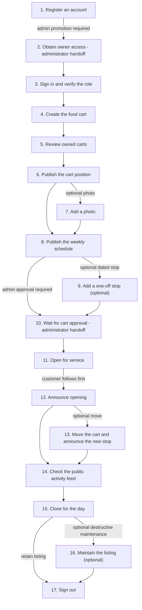

# Cart Owner Journey — Launch and Operate a Food Cart

[All journeys](../README.md) · Role after approval: `owner` · Example person: **Kenji Sato** (`kenji@example.test`).

Kenji creates **Tokyo Taco Club** and publishes operating information. The administrator must promote his account and approve his cart; neither action can be self-authorized through the owner API.

```bash
export BASE_URL=http://localhost:8000
```

## 1. Register an account

Kenji starts with normal registration. There is no public privileged-role registration.

**API:** `POST /api/v1/auth/register`

```bash
curl -i -X POST "$BASE_URL/api/v1/auth/register" \
  -H 'Accept: application/json' \
  -H 'Content-Type: application/json' \
  --data '{"name":"Kenji Sato","email":"kenji@example.test","password":"Journey-Kenji-2026!","password_confirmation":"Journey-Kenji-2026!"}'
```

**Expected:** 201 with a user ID and token; role is customer. Record the actual user ID and give it to Mika for promotion.

```json
{"user":{"id":201,"name":"Kenji Sato","role":"customer"},"token":"<initial-account-token>"}
```

## 2. Obtain owner access — administrator handoff

Mika performs `PATCH /api/v1/admin/users/{Kenji's ID}` with `{"role":"owner","is_active":true}` using **her** admin token. See [administrator step 3](../admin/README.md). Kenji must wait for approval before calling `/owner/*`; customer-role calls return 403. Role is loaded from the account on each request, so an existing valid token sees the promotion; signing in again below is also supported.

## 3. Sign in and verify the role

Kenji signs in with the promoted account.

**API:** `POST /api/v1/auth/login`

```bash
curl -i -X POST "$BASE_URL/api/v1/auth/login" \
  -H 'Accept: application/json' \
  -H 'Content-Type: application/json' \
  --data '{"email":"kenji@example.test","password":"Journey-Kenji-2026!"}'
```

**Expected:** 200; `user.role` must be owner.

```bash
export OWNER_TOKEN='<token returned by login>'
```
```bash
curl -i -X GET "$BASE_URL/api/v1/me" \
  -H 'Accept: application/json' \
  -H "Authorization: Bearer $OWNER_TOKEN"
```

**Expected:** 200 with Kenji’s profile and `role: owner`.

## 4. Create the food cart

Create the cart closed while preparing its details. The owner ID is taken from the token.

**API:** `POST /api/v1/owner/carts`

```bash
curl -i -X POST "$BASE_URL/api/v1/owner/carts" \
  -H 'Accept: application/json' \
  -H "Authorization: Bearer $OWNER_TOKEN" \
  -H 'Content-Type: application/json' \
  --data '{"name":"Tokyo Taco Club","description":"Fresh tacos and seasonal salsa near Tokyo station.","cuisine":"Mexican","status":"closed"}'
```

**Expected:** 201 with `id`, `owner_id`, and `moderation_status: pending`. It is not publicly visible yet.

```bash
export CART_ID=401 # Replace with the ID returned by creation.
```

## 5. Review owned carts

Kenji can see his own pending or rejected carts here, unlike public discovery.

**API:** `GET /api/v1/owner/carts?page=1`

```bash
curl -i -X GET "$BASE_URL/api/v1/owner/carts?page=1" \
  -H 'Accept: application/json' \
  -H "Authorization: Bearer $OWNER_TOKEN"
```

**Expected:** 200 with Kenji’s carts and related locations/photos/schedules. Save any IDs needed when resuming later.

## 6. Publish the cart position

Send the current GPS position and readable address.

**API:** `PUT /api/v1/owner/carts/$CART_ID/location`

```bash
curl -i -X PUT "$BASE_URL/api/v1/owner/carts/$CART_ID/location" \
  -H 'Accept: application/json' \
  -H "Authorization: Bearer $OWNER_TOKEN" \
  -H 'Content-Type: application/json' \
  --data '{"latitude":35.6812,"longitude":139.7671,"address":"Tokyo station, Marunouchi exit"}'
```

**Expected:** 201 on first location, 200 on later updates. Refresh periodically to prevent the marker becoming stale.

## 7. Add a photo

**API:** `POST /api/v1/owner/carts/{cart}/photos` (multipart).

The repository includes a tiny test PNG. Replace it with a real food-cart image for a useful listing. Do not manually set a JSON Content-Type for multipart uploads.

```bash
curl -i -X POST "$BASE_URL/api/v1/owner/carts/$CART_ID/photos"   -H 'Accept: application/json'   -H "Authorization: Bearer $OWNER_TOKEN"   -F 'photo=@doc/test/fixtures/cart.png'
```

**Expected:** 201 with `id`, `path`, and public `url`. JPEG/PNG/WebP only, up to 5 MB each and 10 photos per cart.

```bash
export PHOTO_ID=901 # Replace with the returned photo ID.
```

## 8. Publish the weekly schedule

Set a Monday serving window. This does not automatically change open/closed status.

**API:** `PUT /api/v1/owner/carts/$CART_ID/schedules`

```bash
curl -i -X PUT "$BASE_URL/api/v1/owner/carts/$CART_ID/schedules" \
  -H 'Accept: application/json' \
  -H "Authorization: Bearer $OWNER_TOKEN" \
  -H 'Content-Type: application/json' \
  --data '{"day_of_week":1,"opens_at":"11:00","closes_at":"14:00","timezone":"Asia/Tokyo","address":"Tokyo station, Marunouchi exit","specific_date":null,"is_active":true,"latitude":35.6812,"longitude":139.7671}'
```

**Expected:** 201 for a new cart/weekday/date combination, then 200 when updating that entry. Record the returned schedule ID.

```bash
export WEEKLY_SCHEDULE_ID=501 # Replace with the returned ID.
```

## 9. Add a one-off stop (optional)

Publish an upcoming Sunday stop; replace the example date when appropriate. day_of_week uses Monday=1 through Sunday=7.

**API:** `PUT /api/v1/owner/carts/$CART_ID/schedules`

```bash
curl -i -X PUT "$BASE_URL/api/v1/owner/carts/$CART_ID/schedules" \
  -H 'Accept: application/json' \
  -H "Authorization: Bearer $OWNER_TOKEN" \
  -H 'Content-Type: application/json' \
  --data '{"day_of_week":7,"opens_at":"12:00","closes_at":"17:00","timezone":"Asia/Tokyo","address":"Tokyo station plaza","specific_date":"2026-10-04","is_active":true,"latitude":35.6812,"longitude":139.7671}'
```

**Expected:** 201 for the new dated entry. Save its returned ID separately from the weekly entry.

```bash
export ONE_OFF_SCHEDULE_ID=502 # Replace with the returned dated-entry ID.
```

## 10. Wait for cart approval — administrator handoff

Mika reviews the listing using `GET /api/v1/admin/carts` and approves it with `PATCH /api/v1/admin/carts/{cart}`. Kenji cannot approve the cart himself. Once approved, the public detail endpoint becomes available:

```bash
curl -i -X GET "$BASE_URL/api/v1/carts/$CART_ID" \
  -H 'Accept: application/json'
```

**Expected:** 200 after approval; 404 while pending/rejected. Public nearby searches also require a fresh location.

## 11. Open for service

Kenji explicitly sets the cart open. For the shared demonstration, let Aiko finish following the cart before publishing the next update.

**API:** `PATCH /api/v1/owner/carts/$CART_ID`

```bash
curl -i -X PATCH "$BASE_URL/api/v1/owner/carts/$CART_ID" \
  -H 'Accept: application/json' \
  -H "Authorization: Bearer $OWNER_TOKEN" \
  -H 'Content-Type: application/json' \
  --data '{"name":"Tokyo Taco Club","description":"Fresh tacos and seasonal salsa near Tokyo station.","cuisine":"Mexican","status":"open"}'
```

**Expected:** 200 with status=open. This changes cart state but does not itself notify followers.

## 12. Announce opening

Publish one activity update after Aiko has followed.

**API:** `POST /api/v1/owner/carts/$CART_ID/updates`

```bash
curl -i -X POST "$BASE_URL/api/v1/owner/carts/$CART_ID/updates" \
  -H 'Accept: application/json' \
  -H "Authorization: Bearer $OWNER_TOKEN" \
  -H 'Content-Type: application/json' \
  --data '{"title":"Lunch is ready","body":"We are serving fresh tacos at the Marunouchi exit until 14:00.","type":"opened"}'
```

**Expected:** 201 with the new update. The scheduler later generates notifications for eligible followers. Pending/rejected carts cannot publish updates (403).

## 13. Move the cart and announce the new stop

Publish the changed GPS reading first.

**API:** `PUT /api/v1/owner/carts/$CART_ID/location`

```bash
curl -i -X PUT "$BASE_URL/api/v1/owner/carts/$CART_ID/location" \
  -H 'Accept: application/json' \
  -H "Authorization: Bearer $OWNER_TOKEN" \
  -H 'Content-Type: application/json' \
  --data '{"latitude":35.682,"longitude":139.768,"address":"Tokyo station plaza"}'
```

**Expected:** 200, with refreshed location timestamp.
```bash
curl -i -X POST "$BASE_URL/api/v1/owner/carts/$CART_ID/updates" \
  -H 'Accept: application/json' \
  -H "Authorization: Bearer $OWNER_TOKEN" \
  -H 'Content-Type: application/json' \
  --data '{"title":"Find us at the plaza","body":"We moved to Tokyo station plaza for the afternoon.","type":"moved"}'
```

**Expected:** 201. The client should avoid publishing an announcement for every background GPS sample.

## 14. Check the public activity feed

Confirm customers can see the announcements.

**API:** `GET /api/v1/carts/$CART_ID/updates?page=1`

```bash
curl -i -X GET "$BASE_URL/api/v1/carts/$CART_ID/updates?page=1" \
  -H 'Accept: application/json'
```

**Expected:** 200 with newest activity first. This verifies publication, not actual push receipt.

## 15. Close for the day

Set status closed when service ends; a schedule alone will not do it.

**API:** `PATCH /api/v1/owner/carts/$CART_ID`

```bash
curl -i -X PATCH "$BASE_URL/api/v1/owner/carts/$CART_ID" \
  -H 'Accept: application/json' \
  -H "Authorization: Bearer $OWNER_TOKEN" \
  -H 'Content-Type: application/json' \
  --data '{"status":"closed"}'
```

**Expected:** 200; the cart is no longer eligible for newly generated nearby alerts.
```bash
curl -i -X POST "$BASE_URL/api/v1/owner/carts/$CART_ID/updates" \
  -H 'Accept: application/json' \
  -H "Authorization: Bearer $OWNER_TOKEN" \
  -H 'Content-Type: application/json' \
  --data '{"title":"See you next time","body":"We are closed for today. Thanks for stopping by!","type":"closed"}'
```

**Expected:** 201. Eligible followers receive an update after scheduled processing.

## 16. Maintain the listing (optional)

Delete only records you intend to remove. These calls are cleanup branches, not required at the end of every day.
```bash
curl -i -X DELETE "$BASE_URL/api/v1/owner/carts/$CART_ID/schedules/$ONE_OFF_SCHEDULE_ID" \
  -H 'Accept: application/json' \
  -H "Authorization: Bearer $OWNER_TOKEN"
```

**Expected:** 204; only the dated stop is removed.
```bash
curl -i -X DELETE "$BASE_URL/api/v1/owner/carts/$CART_ID/photos/$PHOTO_ID" \
  -H 'Accept: application/json' \
  -H "Authorization: Bearer $OWNER_TOKEN"
```

**Expected:** 204; the photo row and file are removed.
```bash
curl -i -X DELETE "$BASE_URL/api/v1/owner/carts/$CART_ID" \
  -H 'Accept: application/json' \
  -H "Authorization: Bearer $OWNER_TOKEN"
```

**Expected:** 204; permanently removes the cart and related records/files. Use closing status for a temporary closure. After deletion the remaining cart URLs return 404.

## 17. Sign out

Revoke the current API token when finished.

**API:** `POST /api/v1/auth/logout`

```bash
curl -i -X POST "$BASE_URL/api/v1/auth/logout" \
  -H 'Accept: application/json' \
  -H "Authorization: Bearer $OWNER_TOKEN"
```

**Expected:** 204. If this owner session registered a device through the shared account API, remove that device first. Clear client credentials afterward.

## Access boundaries

Another owner’s existing cart returns 403 on owner writes. A photo/schedule belonging to a different cart returns 404. Owners cannot change is_featured, moderation_status, another account’s role, or notification recipients. Customer account/preferences/device endpoints also work for owner accounts.


## Database usage, diagram flow, and JSON examples

This appendix supplements the unchanged journey above. Step numbers match the original sections. Table links point to the actual MySQL schema. Reads/writes below describe successful application paths; validation or authorization failures can stop processing earlier.

### How to read the JSON

The **request descriptor** is a JSON description of the HTTP request, not a payload to POST verbatim. Send only its `body` as JSON; `path`, `query`, and `headers` belong to the HTTP request. GET and bodyless calls use `body: null` to mean **send no request body**. Uploads use real multipart file bytes, not JSON.

The **response descriptor** shows an HTTP status and an illustrative JSON body excerpt. Additional fields/timestamps may be returned. For 204, `body: null` means an **empty HTTP response**, not a literal JSON `null` response. CLI and browser steps are explicitly labeled and do not imply new JSON endpoints.

Example IDs are shared across journeys: customer 101, owner 201, admin 301, cart 401, weekly schedule 501, one-off schedule 502, device 601, notification 701, report 801, photo 901. Replace them with actual IDs. Examples illustrate a successful instance of each step, not a single replayable database snapshot. In particular, list rows and timestamps depend on when the request runs; owner/admin approval, opening, and following must happen in the order described above.

### Common tables used across steps

| Mechanism | MySQL tables | Behavior |
|---|---|---|
| Bearer authentication on protected calls | [users](../../db/users.md), [personal_access_tokens](../../db/personal_access_tokens.md) | Read token hash, expiry, user, and active state; Sanctum can update token last_used_at. The caller's role limits privileged routes. |
| Request rate limiting with database cache | [cache](../../db/cache.md) | Read/write throttle counters. Redis replaces this usage when configured. |
| Browser dashboard session | [sessions](../../db/sessions.md), [users](../../db/users.md) | Separate session/CSRF authentication; REST bearer tokens do not sign into dashboard forms. |
| Scheduler mutual exclusion | [cache](../../db/cache.md), [cache_locks](../../db/cache_locks.md) | Prevent overlapping dispatch. Redis replaces these cache/lock tables when enabled. |

Common authentication/cache tables are additional to each step's domain tables. No API directly receives a SQL connection, table name, or database password.

### Diagram-ready flow

Use the Mermaid source below when generating an image later. Each node matches a journey step. The detailed table and JSON blocks below can be used as image annotations. Optional cleanup, blocking, and alternative login steps are branches to choose, not mandatory actions.



### Step 1. Register an account

| Table | Read/write purpose in this step |
|---|---|
| [users](../../db/users.md) | Read email uniqueness; insert customer with hashed password. |
| [user_settings](../../db/user_settings.md) | Insert default preferences. |
| [personal_access_tokens](../../db/personal_access_tokens.md) | Insert hash and expiry for the returned bearer token. |

**Call 1: `POST /api/v1/auth/register`**

**Flow:** public client → route/authentication → validation and permissions → `users`, `user_settings`, `personal_access_tokens` → HTTP response.

**Request descriptor:**

```json
{
  "method": "POST",
  "path": "/api/v1/auth/register",
  "headers": {
    "Accept": "application/json",
    "Content-Type": "application/json"
  },
  "query": {},
  "body": {
    "name": "Kenji Sato",
    "email": "kenji@example.test",
    "password": "Journey-Kenji-2026!",
    "password_confirmation": "Journey-Kenji-2026!"
  }
}
```

**Response descriptor (example excerpt):**

```json
{
  "status": 201,
  "body": {
    "user": {
      "id": 201,
      "name": "Kenji Sato",
      "email": "kenji@example.test",
      "role": "customer",
      "is_active": true
    },
    "token": "<new-account-token>"
  }
}
```

### Step 2. Obtain owner access — administrator handoff

**Role handoff:** The approval request below is made by Mika with an admin token, not by Kenji.

| Table | Read/write purpose in this step |
|---|---|
| [users](../../db/users.md) | Read target account and update role/active status. |
| [personal_access_tokens](../../db/personal_access_tokens.md) | Delete target user’s tokens if disabling. |
| [carts](../../db/carts.md) | Not updated here; later public reads hide carts when owner is inactive. |

**Call 1: `PATCH /api/v1/admin/users/201`**

**Flow:** authenticated caller → route/authentication → validation and permissions → `users`, `personal_access_tokens`, `carts` → HTTP response.

**Request descriptor:**

```json
{
  "method": "PATCH",
  "path": "/api/v1/admin/users/201",
  "headers": {
    "Accept": "application/json",
    "Content-Type": "application/json",
    "Authorization": "Bearer <admin-token>"
  },
  "query": {},
  "body": {
    "role": "owner",
    "is_active": true
  }
}
```

**Response descriptor (example excerpt):**

```json
{
  "status": 200,
  "body": {
    "id": 201,
    "name": "Kenji Sato",
    "email": "kenji@example.test",
    "role": "owner",
    "is_active": true
  }
}
```

### Step 3. Sign in and verify the role

| Table | Read/write purpose in this step |
|---|---|
| [users](../../db/users.md) | Read account/password hash and active status. Read current account. |
| [personal_access_tokens](../../db/personal_access_tokens.md) | Insert new token hash and expiry. |

**Call 1: `POST /api/v1/auth/login`**

**Flow:** public client → route/authentication → validation and permissions → `users`, `personal_access_tokens` → HTTP response.

**Request descriptor:**

```json
{
  "method": "POST",
  "path": "/api/v1/auth/login",
  "headers": {
    "Accept": "application/json",
    "Content-Type": "application/json"
  },
  "query": {},
  "body": {
    "email": "kenji@example.test",
    "password": "Journey-Kenji-2026!"
  }
}
```

**Response descriptor (example excerpt):**

```json
{
  "status": 200,
  "body": {
    "user": {
      "id": 201,
      "name": "Kenji Sato",
      "email": "kenji@example.test",
      "role": "owner",
      "is_active": true
    },
    "token": "<new-owner-token>"
  }
}
```

**Call 2: `GET /api/v1/me`**

**Flow:** authenticated caller → route/authentication → validation and permissions → `users` → HTTP response.

**Request descriptor:**

```json
{
  "method": "GET",
  "path": "/api/v1/me",
  "headers": {
    "Accept": "application/json",
    "Authorization": "Bearer <owner-token>"
  },
  "query": {},
  "body": null
}
```

**Response descriptor (example excerpt):**

```json
{
  "status": 200,
  "body": {
    "id": 201,
    "name": "Kenji Sato",
    "email": "kenji@example.test",
    "role": "owner",
    "is_active": true
  }
}
```

### Step 4. Create the food cart

| Table | Read/write purpose in this step |
|---|---|
| [carts](../../db/carts.md) | Insert cart owned by caller, pending moderation. |

**Call 1: `POST /api/v1/owner/carts`**

**Flow:** authenticated caller → route/authentication → validation and permissions → `carts` → HTTP response.

**Request descriptor:**

```json
{
  "method": "POST",
  "path": "/api/v1/owner/carts",
  "headers": {
    "Accept": "application/json",
    "Authorization": "Bearer <owner-token>",
    "Content-Type": "application/json"
  },
  "query": {},
  "body": {
    "name": "Tokyo Taco Club",
    "description": "Fresh tacos and seasonal salsa near Tokyo station.",
    "cuisine": "Mexican",
    "status": "closed"
  }
}
```

**Response descriptor (example excerpt):**

```json
{
  "status": 201,
  "body": {
    "id": 401,
    "owner_id": 201,
    "name": "Tokyo Taco Club",
    "description": "Fresh tacos and seasonal salsa near Tokyo station.",
    "cuisine": "Mexican",
    "status": "closed",
    "moderation_status": "pending",
    "is_featured": false
  }
}
```

### Step 5. Review owned carts

| Table | Read/write purpose in this step |
|---|---|
| [carts](../../db/carts.md) | Read only carts owned by caller, regardless of moderation status. |
| [cart_locations](../../db/cart_locations.md) | Read positions. |
| [photos](../../db/photos.md) | Read photo references. |
| [cart_schedules](../../db/cart_schedules.md) | Read schedule entries. |

**Call 1: `GET /api/v1/owner/carts`**

**Flow:** authenticated caller → route/authentication → validation and permissions → `carts`, `cart_locations`, `photos`, `cart_schedules` → HTTP response.

**Request descriptor:**

```json
{
  "method": "GET",
  "path": "/api/v1/owner/carts",
  "headers": {
    "Accept": "application/json",
    "Authorization": "Bearer <owner-token>"
  },
  "query": {
    "page": "1"
  },
  "body": null
}
```

**Response descriptor (example excerpt):**

```json
{
  "status": 200,
  "body": {
    "data": [
      {
        "id": 401,
        "owner_id": 201,
        "name": "Tokyo Taco Club",
        "description": "Fresh tacos and seasonal salsa near Tokyo station.",
        "cuisine": "Mexican",
        "status": "closed",
        "moderation_status": "pending",
        "is_featured": false,
        "location": null,
        "photos": [],
        "schedules": []
      }
    ],
    "current_page": 1,
    "per_page": 25,
    "total": 1,
    "last_page": 1,
    "next_page_url": null
  }
}
```

### Step 6. Publish the cart position

| Table | Read/write purpose in this step |
|---|---|
| [carts](../../db/carts.md) | Read ownership. |
| [cart_locations](../../db/cart_locations.md) | Insert/update coordinates/address and touch timestamp. |

**Call 1: `PUT /api/v1/owner/carts/401/location`**

**Flow:** authenticated caller → route/authentication → validation and permissions → `carts`, `cart_locations` → HTTP response.

**Request descriptor:**

```json
{
  "method": "PUT",
  "path": "/api/v1/owner/carts/401/location",
  "headers": {
    "Accept": "application/json",
    "Authorization": "Bearer <owner-token>",
    "Content-Type": "application/json"
  },
  "query": {},
  "body": {
    "latitude": 35.6812,
    "longitude": 139.7671,
    "address": "Tokyo station, Marunouchi exit"
  }
}
```

**Response descriptor (example excerpt):**

```json
{
  "status": 201,
  "body": {
    "id": 411,
    "cart_id": 401,
    "latitude": 35.6812,
    "longitude": 139.7671,
    "address": "Tokyo station, Marunouchi exit",
    "updated_at": "2026-09-13T03:00:00.000000Z"
  }
}
```

Creation may return 201 and updating an existing row returns 200. The example status assumes the state described at this step.

### Step 7. Add a photo

| Table | Read/write purpose in this step |
|---|---|
| [carts](../../db/carts.md) | Check ownership. |
| [photos](../../db/photos.md) | Count existing photos and insert stored file path. |

**Call 1: `POST /api/v1/owner/carts/401/photos`**

**Flow:** authenticated caller → route/authentication → validation and permissions → `carts`, `photos` → HTTP response.

**Request descriptor:**

```json
{
  "method": "POST",
  "path": "/api/v1/owner/carts/401/photos",
  "headers": {
    "Accept": "application/json",
    "Authorization": "Bearer <owner-token>",
    "Content-Type": "multipart/form-data; boundary=<generated-by-client>"
  },
  "query": {},
  "body": null,
  "multipart": {
    "photo": {
      "filename": "cart.png",
      "content_type": "image/png",
      "source": "doc/test/fixtures/cart.png"
    }
  }
}
```

**Response descriptor (example excerpt):**

```json
{
  "status": 201,
  "body": {
    "id": 901,
    "cart_id": 401,
    "path": "carts/401/example.png",
    "url": "http://localhost:8000/storage/carts/401/example.png"
  }
}
```

### Step 8. Publish the weekly schedule

| Table | Read/write purpose in this step |
|---|---|
| [carts](../../db/carts.md) | Check ownership. |
| [cart_schedules](../../db/cart_schedules.md) | Insert/update by cart, weekday and optional specific_date. |

**Call 1: `PUT /api/v1/owner/carts/401/schedules`**

**Flow:** authenticated caller → route/authentication → validation and permissions → `carts`, `cart_schedules` → HTTP response.

**Request descriptor:**

```json
{
  "method": "PUT",
  "path": "/api/v1/owner/carts/401/schedules",
  "headers": {
    "Accept": "application/json",
    "Authorization": "Bearer <owner-token>",
    "Content-Type": "application/json"
  },
  "query": {},
  "body": {
    "day_of_week": 1,
    "opens_at": "11:00",
    "closes_at": "14:00",
    "timezone": "Asia/Tokyo",
    "address": "Tokyo station, Marunouchi exit",
    "specific_date": null,
    "is_active": true,
    "latitude": 35.6812,
    "longitude": 139.7671
  }
}
```

**Response descriptor (example excerpt):**

```json
{
  "status": 201,
  "body": {
    "id": 501,
    "cart_id": 401,
    "day_of_week": 1,
    "opens_at": "11:00",
    "closes_at": "14:00",
    "timezone": "Asia/Tokyo",
    "specific_date": null,
    "is_active": true,
    "address": "Tokyo station, Marunouchi exit",
    "latitude": 35.6812,
    "longitude": 139.7671
  }
}
```

Creation may return 201 and updating an existing row returns 200. The example status assumes the state described at this step.

### Step 9. Add a one-off stop (optional)

| Table | Read/write purpose in this step |
|---|---|
| [carts](../../db/carts.md) | Check ownership. |
| [cart_schedules](../../db/cart_schedules.md) | Insert/update by cart, weekday and optional specific_date. |

**Call 1: `PUT /api/v1/owner/carts/401/schedules`**

**Flow:** authenticated caller → route/authentication → validation and permissions → `carts`, `cart_schedules` → HTTP response.

**Request descriptor:**

```json
{
  "method": "PUT",
  "path": "/api/v1/owner/carts/401/schedules",
  "headers": {
    "Accept": "application/json",
    "Authorization": "Bearer <owner-token>",
    "Content-Type": "application/json"
  },
  "query": {},
  "body": {
    "day_of_week": 7,
    "opens_at": "12:00",
    "closes_at": "17:00",
    "timezone": "Asia/Tokyo",
    "address": "Tokyo station plaza",
    "specific_date": "2026-10-04",
    "is_active": true,
    "latitude": 35.6812,
    "longitude": 139.7671
  }
}
```

**Response descriptor (example excerpt):**

```json
{
  "status": 201,
  "body": {
    "id": 502,
    "cart_id": 401,
    "day_of_week": 7,
    "opens_at": "12:00",
    "closes_at": "17:00",
    "timezone": "Asia/Tokyo",
    "specific_date": "2026-10-04",
    "is_active": true,
    "address": "Tokyo station plaza",
    "latitude": 35.6812,
    "longitude": 139.7671
  }
}
```

Creation may return 201 and updating an existing row returns 200. The example status assumes the state described at this step.

### Step 10. Wait for cart approval — administrator handoff

**Role handoff:** The approval request below is made by Mika with an admin token, not by Kenji.

| Table | Read/write purpose in this step |
|---|---|
| [carts](../../db/carts.md) | Update moderation_status and/or is_featured. Read listing and verify visibility. |
| [users](../../db/users.md) | Check owner active status. |
| [follows](../../db/follows.md) | Visibility scope includes follower-count subquery. |
| [cart_locations](../../db/cart_locations.md) | Read current position. |
| [photos](../../db/photos.md) | Read photo references. |
| [cart_schedules](../../db/cart_schedules.md) | Read schedules. |

**Call 1: `PATCH /api/v1/admin/carts/401`**

**Flow:** authenticated caller → route/authentication → validation and permissions → `carts` → HTTP response.

**Request descriptor:**

```json
{
  "method": "PATCH",
  "path": "/api/v1/admin/carts/401",
  "headers": {
    "Accept": "application/json",
    "Content-Type": "application/json",
    "Authorization": "Bearer <admin-token>"
  },
  "query": {},
  "body": {
    "moderation_status": "approved",
    "is_featured": false
  }
}
```

**Response descriptor (example excerpt):**

```json
{
  "status": 200,
  "body": {
    "id": 401,
    "owner_id": 201,
    "name": "Tokyo Taco Club",
    "description": "Fresh tacos and seasonal salsa near Tokyo station.",
    "cuisine": "Mexican",
    "status": "open",
    "moderation_status": "approved",
    "is_featured": false
  }
}
```

**Call 2: `GET /api/v1/carts/401`**

**Flow:** public client → route/authentication → validation and permissions → `carts`, `users`, `follows`, `cart_locations`, `photos`, `cart_schedules` → HTTP response.

**Request descriptor:**

```json
{
  "method": "GET",
  "path": "/api/v1/carts/401",
  "headers": {
    "Accept": "application/json"
  },
  "query": {},
  "body": null
}
```

**Response descriptor (example excerpt):**

```json
{
  "status": 200,
  "body": {
    "id": 401,
    "owner_id": 201,
    "name": "Tokyo Taco Club",
    "description": "Fresh tacos and seasonal salsa near Tokyo station.",
    "cuisine": "Mexican",
    "status": "closed",
    "moderation_status": "approved",
    "is_featured": false,
    "location": {
      "id": 411,
      "cart_id": 401,
      "latitude": 35.6812,
      "longitude": 139.7671,
      "address": "Tokyo station, Marunouchi exit",
      "updated_at": "2026-09-13T03:00:00.000000Z"
    },
    "photos": [
      {
        "id": 901,
        "cart_id": 401,
        "path": "carts/401/example.png",
        "url": "http://localhost:8000/storage/carts/401/example.png"
      }
    ],
    "schedules": [
      {
        "id": 501,
        "cart_id": 401,
        "day_of_week": 1,
        "opens_at": "11:00:00",
        "closes_at": "14:00:00",
        "timezone": "Asia/Tokyo",
        "specific_date": null,
        "is_active": 1
      }
    ]
  }
}
```

### Step 11. Open for service

| Table | Read/write purpose in this step |
|---|---|
| [carts](../../db/carts.md) | Resolve ownership and update editable fields. |

**Call 1: `PATCH /api/v1/owner/carts/401`**

**Flow:** authenticated caller → route/authentication → validation and permissions → `carts` → HTTP response.

**Request descriptor:**

```json
{
  "method": "PATCH",
  "path": "/api/v1/owner/carts/401",
  "headers": {
    "Accept": "application/json",
    "Authorization": "Bearer <owner-token>",
    "Content-Type": "application/json"
  },
  "query": {},
  "body": {
    "name": "Tokyo Taco Club",
    "description": "Fresh tacos and seasonal salsa near Tokyo station.",
    "cuisine": "Mexican",
    "status": "open"
  }
}
```

**Response descriptor (example excerpt):**

```json
{
  "status": 200,
  "body": {
    "id": 401,
    "owner_id": 201,
    "name": "Tokyo Taco Club",
    "description": "Fresh tacos and seasonal salsa near Tokyo station.",
    "cuisine": "Mexican",
    "status": "open",
    "moderation_status": "approved",
    "is_featured": false
  }
}
```

### Step 12. Announce opening

| Table | Read/write purpose in this step |
|---|---|
| [carts](../../db/carts.md) | Check ownership and approved moderation status. |
| [cart_updates](../../db/cart_updates.md) | Insert activity; fanout_at remains null for scheduler. |

**Call 1: `POST /api/v1/owner/carts/401/updates`**

**Flow:** authenticated caller → route/authentication → validation and permissions → `carts`, `cart_updates` → HTTP response.

The HTTP call writes only the activity event after checking the cart. `notifications` and `push_deliveries` are generated later by the scheduler, not synchronously by this call.

**Request descriptor:**

```json
{
  "method": "POST",
  "path": "/api/v1/owner/carts/401/updates",
  "headers": {
    "Accept": "application/json",
    "Authorization": "Bearer <owner-token>",
    "Content-Type": "application/json"
  },
  "query": {},
  "body": {
    "title": "Lunch is ready",
    "body": "We are serving fresh tacos at the Marunouchi exit until 14:00.",
    "type": "opened"
  }
}
```

**Response descriptor (example excerpt):**

```json
{
  "status": 201,
  "body": {
    "id": 1001,
    "cart_id": 401,
    "title": "Lunch is ready",
    "body": "We are serving fresh tacos at the Marunouchi exit until 14:00.",
    "type": "opened",
    "created_at": "2026-09-13T03:00:00.000000Z",
    "fanout_at": null
  }
}
```

### Step 13. Move the cart and announce the new stop

| Table | Read/write purpose in this step |
|---|---|
| [carts](../../db/carts.md) | Read ownership. Check ownership and approved moderation status. |
| [cart_locations](../../db/cart_locations.md) | Insert/update coordinates/address and touch timestamp. |
| [cart_updates](../../db/cart_updates.md) | Insert activity; fanout_at remains null for scheduler. |

**Call 1: `PUT /api/v1/owner/carts/401/location`**

**Flow:** authenticated caller → route/authentication → validation and permissions → `carts`, `cart_locations` → HTTP response.

**Request descriptor:**

```json
{
  "method": "PUT",
  "path": "/api/v1/owner/carts/401/location",
  "headers": {
    "Accept": "application/json",
    "Authorization": "Bearer <owner-token>",
    "Content-Type": "application/json"
  },
  "query": {},
  "body": {
    "latitude": 35.682,
    "longitude": 139.768,
    "address": "Tokyo station plaza"
  }
}
```

**Response descriptor (example excerpt):**

```json
{
  "status": 200,
  "body": {
    "id": 411,
    "cart_id": 401,
    "latitude": 35.682,
    "longitude": 139.768,
    "address": "Tokyo station plaza",
    "updated_at": "2026-09-13T03:00:00.000000Z"
  }
}
```

Creation may return 201 and updating an existing row returns 200. The example status assumes the state described at this step.

**Call 2: `POST /api/v1/owner/carts/401/updates`**

**Flow:** authenticated caller → route/authentication → validation and permissions → `carts`, `cart_updates` → HTTP response.

The HTTP call writes only the activity event after checking the cart. `notifications` and `push_deliveries` are generated later by the scheduler, not synchronously by this call.

**Request descriptor:**

```json
{
  "method": "POST",
  "path": "/api/v1/owner/carts/401/updates",
  "headers": {
    "Accept": "application/json",
    "Authorization": "Bearer <owner-token>",
    "Content-Type": "application/json"
  },
  "query": {},
  "body": {
    "title": "Find us at the plaza",
    "body": "We moved to Tokyo station plaza for the afternoon.",
    "type": "moved"
  }
}
```

**Response descriptor (example excerpt):**

```json
{
  "status": 201,
  "body": {
    "id": 1001,
    "cart_id": 401,
    "title": "Find us at the plaza",
    "body": "We moved to Tokyo station plaza for the afternoon.",
    "type": "moved",
    "created_at": "2026-09-13T03:00:00.000000Z",
    "fanout_at": null
  }
}
```

### Step 14. Check the public activity feed

| Table | Read/write purpose in this step |
|---|---|
| [carts](../../db/carts.md) | Verify public visibility. |
| [users](../../db/users.md) | Check owner active status. |
| [follows](../../db/follows.md) | Visibility scope includes follower-count subquery. |
| [cart_locations](../../db/cart_locations.md) | Visibility helper loads the location. |
| [photos](../../db/photos.md) | Visibility helper loads photos. |
| [cart_schedules](../../db/cart_schedules.md) | Visibility helper loads schedules. |
| [cart_updates](../../db/cart_updates.md) | Read this cart’s public activity. |

**Call 1: `GET /api/v1/carts/401/updates`**

**Flow:** public client → route/authentication → validation and permissions → `carts`, `users`, `follows`, `cart_locations`, `photos`, `cart_schedules`, `cart_updates` → HTTP response.

**Request descriptor:**

```json
{
  "method": "GET",
  "path": "/api/v1/carts/401/updates",
  "headers": {
    "Accept": "application/json"
  },
  "query": {
    "page": "1"
  },
  "body": null
}
```

**Response descriptor (example excerpt):**

```json
{
  "status": 200,
  "body": {
    "data": [
      {
        "id": 1001,
        "cart_id": 401,
        "title": "Lunch is ready",
        "body": "We are serving fresh tacos until 14:00.",
        "type": "opened",
        "created_at": "2026-09-13T03:00:00.000000Z"
      }
    ],
    "current_page": 1,
    "per_page": 25,
    "total": 1,
    "last_page": 1,
    "next_page_url": null
  }
}
```

### Step 15. Close for the day

| Table | Read/write purpose in this step |
|---|---|
| [carts](../../db/carts.md) | Resolve ownership and update editable fields. Check ownership and approved moderation status. |
| [cart_updates](../../db/cart_updates.md) | Insert activity; fanout_at remains null for scheduler. |

**Call 1: `PATCH /api/v1/owner/carts/401`**

**Flow:** authenticated caller → route/authentication → validation and permissions → `carts` → HTTP response.

**Request descriptor:**

```json
{
  "method": "PATCH",
  "path": "/api/v1/owner/carts/401",
  "headers": {
    "Accept": "application/json",
    "Authorization": "Bearer <owner-token>",
    "Content-Type": "application/json"
  },
  "query": {},
  "body": {
    "status": "closed"
  }
}
```

**Response descriptor (example excerpt):**

```json
{
  "status": 200,
  "body": {
    "id": 401,
    "owner_id": 201,
    "name": "Tokyo Taco Club",
    "description": "Fresh tacos and seasonal salsa near Tokyo station.",
    "cuisine": "Mexican",
    "status": "closed",
    "moderation_status": "approved",
    "is_featured": false
  }
}
```

**Call 2: `POST /api/v1/owner/carts/401/updates`**

**Flow:** authenticated caller → route/authentication → validation and permissions → `carts`, `cart_updates` → HTTP response.

The HTTP call writes only the activity event after checking the cart. `notifications` and `push_deliveries` are generated later by the scheduler, not synchronously by this call.

**Request descriptor:**

```json
{
  "method": "POST",
  "path": "/api/v1/owner/carts/401/updates",
  "headers": {
    "Accept": "application/json",
    "Authorization": "Bearer <owner-token>",
    "Content-Type": "application/json"
  },
  "query": {},
  "body": {
    "title": "See you next time",
    "body": "We are closed for today. Thanks for stopping by!",
    "type": "closed"
  }
}
```

**Response descriptor (example excerpt):**

```json
{
  "status": 201,
  "body": {
    "id": 1001,
    "cart_id": 401,
    "title": "See you next time",
    "body": "We are closed for today. Thanks for stopping by!",
    "type": "closed",
    "created_at": "2026-09-13T03:00:00.000000Z",
    "fanout_at": null
  }
}
```

### Step 16. Maintain the listing (optional)

| Table | Read/write purpose in this step |
|---|---|
| [carts](../../db/carts.md) | Check ownership. Read ownership then delete cart. |
| [cart_schedules](../../db/cart_schedules.md) | Check cart relationship and delete entry. Cascade delete. |
| [photos](../../db/photos.md) | Check cart relationship and delete path record; application removes file. Read paths for filesystem cleanup; cascade removes rows. |
| [cart_locations](../../db/cart_locations.md) | Cascade delete. |
| [cart_updates](../../db/cart_updates.md) | Cascade delete. |
| [follows](../../db/follows.md) | Cascade delete. |
| [notifications](../../db/notifications.md) | Cascade delete messages referencing this cart. |
| [push_deliveries](../../db/push_deliveries.md) | Cascade delete through notifications. |

**Call 1: `DELETE /api/v1/owner/carts/401/schedules/502`**

**Flow:** authenticated caller → route/authentication → validation and permissions → `carts`, `cart_schedules` → HTTP response.

**Request descriptor:**

```json
{
  "method": "DELETE",
  "path": "/api/v1/owner/carts/401/schedules/502",
  "headers": {
    "Accept": "application/json",
    "Authorization": "Bearer <owner-token>"
  },
  "query": {},
  "body": null
}
```

**Response descriptor (example excerpt):**

```json
{
  "status": 204,
  "body": null
}
```

**Call 2: `DELETE /api/v1/owner/carts/401/photos/901`**

**Flow:** authenticated caller → route/authentication → validation and permissions → `carts`, `photos` → HTTP response.

**Request descriptor:**

```json
{
  "method": "DELETE",
  "path": "/api/v1/owner/carts/401/photos/901",
  "headers": {
    "Accept": "application/json",
    "Authorization": "Bearer <owner-token>"
  },
  "query": {},
  "body": null
}
```

**Response descriptor (example excerpt):**

```json
{
  "status": 204,
  "body": null
}
```

**Call 3: `DELETE /api/v1/owner/carts/401`**

**Flow:** authenticated caller → route/authentication → validation and permissions → `carts`, `photos`, `cart_locations`, `cart_schedules`, `cart_updates`, `follows`, `notifications`, `push_deliveries` → HTTP response.

**Request descriptor:**

```json
{
  "method": "DELETE",
  "path": "/api/v1/owner/carts/401",
  "headers": {
    "Accept": "application/json",
    "Authorization": "Bearer <owner-token>"
  },
  "query": {},
  "body": null
}
```

**Response descriptor (example excerpt):**

```json
{
  "status": 204,
  "body": null
}
```

### Step 17. Sign out

| Table | Read/write purpose in this step |
|---|---|
| [personal_access_tokens](../../db/personal_access_tokens.md) | Delete the current bearer token row. |

**Call 1: `POST /api/v1/auth/logout`**

**Flow:** authenticated caller → route/authentication → validation and permissions → `personal_access_tokens` → HTTP response.

**Request descriptor:**

```json
{
  "method": "POST",
  "path": "/api/v1/auth/logout",
  "headers": {
    "Accept": "application/json",
    "Authorization": "Bearer <owner-token>"
  },
  "query": {},
  "body": null
}
```

**Response descriptor (example excerpt):**

```json
{
  "status": 204,
  "body": null
}
```

### Failure examples for diagram branches

At each API step, add error branches before the success node as appropriate. These are illustrative response excerpts, not a promise of exact framework message text:

```json
{"status":401,"body":{"message":"Unauthenticated."}}
```

```json
{"status":403,"body":{"message":"This action is unauthorized."}}
```

```json
{"status":404,"body":{"message":"Resource not found."}}
```

```json
{"status":422,"body":{"message":"The given data was invalid.","errors":{"name":["The name field is required."]}}}
```

```json
{"status":429,"body":{"message":"Too Many Attempts."}}
```

The 422 name example applies to calls validating name, such as registration; other paths return errors keyed to their own fields. CLI failures and browser form validation have different output/redirect behavior. Consult the per-endpoint API test documents for each path's actual validation cases.
