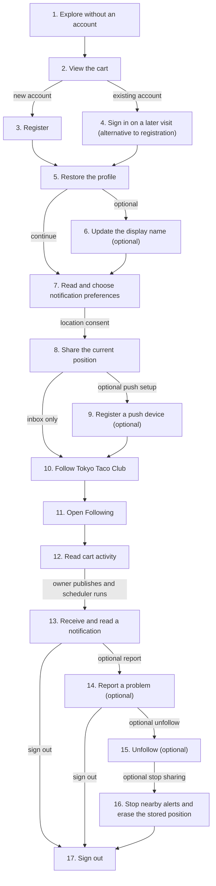

# Normal User Journey — Discover and Follow a Food Cart

[All journeys](../README.md) · Role: `customer` · Example person: **Aiko Tanaka** (`aiko@example.test`).

Aiko wants to find nearby lunch, follow Tokyo Taco Club, and receive updates. Start after Kenji's cart has been approved and has a fresh location, as described in the [owner journey](../cart_owner/README.md).

```bash
export BASE_URL=http://localhost:8000
```

## 1. Explore without an account

Aiko opens Explore. Find approved carts within 5 km of Tokyo station. No token is required.

**API:** `GET /api/v1/carts?search=Tokyo&latitude=35.6812&longitude=139.7671&radius_meters=5000&page=1`

```bash
curl -i -X GET "$BASE_URL/api/v1/carts?search=Tokyo&latitude=35.6812&longitude=139.7671&radius_meters=5000&page=1" \
  -H 'Accept: application/json'
```

**Expected:** 200 with a paginated `data` array, sorted by distance. If empty, check cart approval and location freshness; general catalog browsing uses `/carts?page=1`.

Example response excerpt:

```json
{"data":[{"id":401,"name":"Tokyo Taco Club","status":"open","distance_meters":0}],"current_page":1,"total":1}
```

Copy the selected cart's actual ID (401 is illustrative):

```bash
export CART_ID=401
```

## 2. View the cart

Aiko taps the marker to see the cart details, photos, serving schedule, and published location.

**API:** `GET /api/v1/carts/$CART_ID`

```bash
curl -i -X GET "$BASE_URL/api/v1/carts/$CART_ID" \
  -H 'Accept: application/json'
```

**Expected:** 200 with the cart and its `location`, `photos`, and `schedules`. A missing location may be null; a hidden cart returns 404.

## 3. Register

Aiko creates an account so her follows persist across sessions.

**API:** `POST /api/v1/auth/register`

```bash
curl -i -X POST "$BASE_URL/api/v1/auth/register" \
  -H 'Accept: application/json' \
  -H 'Content-Type: application/json' \
  --data '{"name":"Aiko Tanaka","email":"aiko@example.test","password":"Journey-Aiko-2026!","password_confirmation":"Journey-Aiko-2026!"}'
```

**Expected:** 201 with `user` and `token`; `user.role` is customer. If this email already exists, use login below instead.

```json
{"user":{"id":101,"name":"Aiko Tanaka","email":"aiko@example.test","role":"customer"},"token":"<customer-bearer-token>"}
```

```bash
export CUSTOMER_TOKEN='<token returned by registration or login>'
```

## 4. Sign in on a later visit (alternative to registration)

Use this when the account already exists. Replace CUSTOMER_TOKEN with the newly returned token; registration already provides a token, so this is not required immediately after step 3.

**API:** `POST /api/v1/auth/login`

```bash
curl -i -X POST "$BASE_URL/api/v1/auth/login" \
  -H 'Accept: application/json' \
  -H 'Content-Type: application/json' \
  --data '{"email":"aiko@example.test","password":"Journey-Aiko-2026!"}'
```

**Expected:** 200 with `user` and a new `token`. Wrong credentials return 422.

## 5. Restore the profile

The app checks a securely stored token on startup.

**API:** `GET /api/v1/me`

```bash
curl -i -X GET "$BASE_URL/api/v1/me" \
  -H 'Accept: application/json' \
  -H "Authorization: Bearer $CUSTOMER_TOKEN"
```

**Expected:** 200 with Aiko’s account; password/token fields are not included. On 401, return to login.

## 6. Update the display name (optional)

Aiko shortens the name shown in her profile.

**API:** `PATCH /api/v1/me`

```bash
curl -i -X PATCH "$BASE_URL/api/v1/me" \
  -H 'Accept: application/json' \
  -H "Authorization: Bearer $CUSTOMER_TOKEN" \
  -H 'Content-Type: application/json' \
  --data '{"name":"Aiko T."}'
```

**Expected:** 200; only the name changes. Role and email are not editable through this endpoint.

## 7. Read and choose notification preferences

Show the current settings first.

**API:** `GET /api/v1/me/settings`

```bash
curl -i -X GET "$BASE_URL/api/v1/me/settings" \
  -H 'Accept: application/json' \
  -H "Authorization: Bearer $CUSTOMER_TOKEN"
```

**Expected:** 200; defaults enable push, nearby, and update alerts with a 5000-meter radius.
```bash
curl -i -X PATCH "$BASE_URL/api/v1/me/settings" \
  -H 'Accept: application/json' \
  -H "Authorization: Bearer $CUSTOMER_TOKEN" \
  -H 'Content-Type: application/json' \
  --data '{"push_enabled":true,"nearby_enabled":true,"updates_enabled":true,"radius_meters":5000}'
```

**Expected:** 200 for the existing row. Each setting can be changed independently. Push opt-in alone does not register a device.

## 8. Share the current position

After Aiko grants permission in the client, publish the GPS reading. Refresh periodically while sharing, even if unchanged.

**API:** `PUT /api/v1/me/location`

```bash
curl -i -X PUT "$BASE_URL/api/v1/me/location" \
  -H 'Accept: application/json' \
  -H "Authorization: Bearer $CUSTOMER_TOKEN" \
  -H 'Content-Type: application/json' \
  --data '{"latitude":35.6812,"longitude":139.7671}'
```

**Expected:** 201 on first position, then 200 on updates. The server controls `updated_at`.

## 9. Register a push device (optional)

The app obtains an FCM token and sends it here. The example is synthetic: use it only with PUSH_DRIVER=disabled, or replace it with a real FCM token for delivery testing.

**API:** `POST /api/v1/me/devices`

```bash
curl -i -X POST "$BASE_URL/api/v1/me/devices" \
  -H 'Accept: application/json' \
  -H "Authorization: Bearer $CUSTOMER_TOKEN" \
  -H 'Content-Type: application/json' \
  --data '{"token":"example-aiko-fcm-token-replace-before-live-push","platform":"android"}'
```

**Expected:** 201 for a new device, 200 if already registered. Save the returned `id`; the raw token is hidden.

```bash
export DEVICE_ID=601 # Replace with the returned device ID.
```

## 10. Follow Tokyo Taco Club

Aiko taps Follow. This is per-user persistent state.

**API:** `PUT /api/v1/carts/$CART_ID/follow`

```bash
curl -i -X PUT "$BASE_URL/api/v1/carts/$CART_ID/follow" \
  -H 'Accept: application/json' \
  -H "Authorization: Bearer $CUSTOMER_TOKEN"
```

**Expected:** 201 for a new follow, 200 for an existing row. Repeating does not create duplicates.

## 11. Open Following

The app displays Aiko’s followed, publicly visible carts.

**API:** `GET /api/v1/me/following?page=1`

```bash
curl -i -X GET "$BASE_URL/api/v1/me/following?page=1" \
  -H 'Accept: application/json' \
  -H "Authorization: Bearer $CUSTOMER_TOKEN"
```

**Expected:** 200; `data` contains the followed cart. Other users’ follows do not appear.

## 12. Read cart activity

Read the selected cart’s public activity log.

**API:** `GET /api/v1/carts/$CART_ID/updates?page=1`

```bash
curl -i -X GET "$BASE_URL/api/v1/carts/$CART_ID/updates?page=1" \
  -H 'Accept: application/json'
```

**Expected:** 200 with the selected cart’s updates.
```bash
curl -i -X GET "$BASE_URL/api/v1/me/updates?page=1" \
  -H 'Accept: application/json' \
  -H "Authorization: Bearer $CUSTOMER_TOKEN"
```

**Expected:** 200 with activity from all carts Aiko follows. This feed can include activity published before she followed.

## 13. Receive and read a notification

Ask Kenji to publish an update **after step 10**, then let the scheduler run (every two minutes). For a local demonstration, the server operator can run this command; it is not a customer API:

```bash
docker compose exec app php artisan notifications:dispatch
```

Nearby alerts additionally require the cart to be open, fresh coordinates for both parties, and the configured radius; the same user/cart pair has a ten-minute cooldown.

```bash
curl -i -X GET "$BASE_URL/api/v1/me/notifications?page=1" \
  -H 'Accept: application/json' \
  -H "Authorization: Bearer $CUSTOMER_TOKEN"
```

**Expected:** 200 with Aiko's inbox. Empty `data` is valid when no eligible notification has been generated. Select a returned notification ID:

```bash
export NOTIFICATION_ID=701 # Replace with the actual inbox ID.
```
```bash
curl -i -X PATCH "$BASE_URL/api/v1/me/notifications/$NOTIFICATION_ID/read" \
  -H 'Accept: application/json' \
  -H "Authorization: Bearer $CUSTOMER_TOKEN"
```

**Expected:** 200 with `read_at` populated. Another user’s notification ID returns 404.
```bash
curl -i -X PATCH "$BASE_URL/api/v1/me/notifications/read-all" \
  -H 'Accept: application/json' \
  -H "Authorization: Bearer $CUSTOMER_TOKEN"
```

**Expected:** 204 with no body; all unread messages in Aiko’s inbox are marked read.

## 14. Report a problem (optional)

Aiko notices the cart marker is out of date. Supply the actual CART_ID in JSON.

**API:** `POST /api/v1/reports`

```bash
curl -i -X POST "$BASE_URL/api/v1/reports" \
  -H 'Accept: application/json' \
  -H "Authorization: Bearer $CUSTOMER_TOKEN" \
  -H 'Content-Type: application/json' \
  --data '{"target_type":"cart","target_id":401,"reason":"wrongLocation","note":"The cart was not near the Marunouchi exit at lunchtime."}'
```

**Expected:** 201 with a report ID. `reporter_id` is Aiko; persisted status is open. Share the returned report ID with the admin journey. The ID 401 in this JSON must be replaced if the actual cart differs.

## 15. Unfollow (optional)

After completing the notification demonstration, Aiko can stop following the cart.

**API:** `DELETE /api/v1/carts/$CART_ID/follow`

```bash
curl -i -X DELETE "$BASE_URL/api/v1/carts/$CART_ID/follow" \
  -H 'Accept: application/json' \
  -H "Authorization: Bearer $CUSTOMER_TOKEN"
```

**Expected:** 204. The follow row remains with `is_following=false`; the cart disappears from Following.

## 16. Stop nearby alerts and erase the stored position

When location sharing is disabled, turn off nearby alerts.

**API:** `PATCH /api/v1/me/settings`

```bash
curl -i -X PATCH "$BASE_URL/api/v1/me/settings" \
  -H 'Accept: application/json' \
  -H "Authorization: Bearer $CUSTOMER_TOKEN" \
  -H 'Content-Type: application/json' \
  --data '{"nearby_enabled":false}'
```

**Expected:** 200 for the existing settings row.
```bash
curl -i -X DELETE "$BASE_URL/api/v1/me/location" \
  -H 'Accept: application/json' \
  -H "Authorization: Bearer $CUSTOMER_TOKEN"
```

**Expected:** 204. The client must also stop publishing new coordinates; this call does not change operating-system permissions.

## 17. Sign out

If step 9 registered a device, remove that registration before revoking the session token. Skip device deletion if no device was registered.

**API:** `DELETE /api/v1/me/devices/$DEVICE_ID`

```bash
curl -i -X DELETE "$BASE_URL/api/v1/me/devices/$DEVICE_ID" \
  -H 'Accept: application/json' \
  -H "Authorization: Bearer $CUSTOMER_TOKEN"
```

**Expected:** 204; this device will no longer receive push for Aiko.
```bash
curl -i -X POST "$BASE_URL/api/v1/auth/logout" \
  -H 'Accept: application/json' \
  -H "Authorization: Bearer $CUSTOMER_TOKEN"
```

**Expected:** 204. Clear the locally stored token and private app state. Reusing this bearer token returns 401.

## Completion check

Aiko can discover carts publicly, maintain private follows/preferences, read follower activity and inbox messages, report issues, and revoke access. The app must implement GPS permissions, token storage, and polling/push refresh; the backend does not drive these client interactions.


## Database usage, diagram flow, and JSON examples

This appendix supplements the unchanged journey above. Step numbers match the original sections. Table links point to the actual MySQL schema. Reads/writes below describe successful application paths; validation or authorization failures can stop processing earlier.

### How to read the JSON

The **request descriptor** is a JSON description of the HTTP request, not a payload to POST verbatim. Send only its `body` as JSON; `path`, `query`, and `headers` belong to the HTTP request. GET and bodyless calls use `body: null` to mean **send no request body**. Uploads use real multipart file bytes, not JSON.

The **response descriptor** shows an HTTP status and an illustrative JSON body excerpt. Additional fields/timestamps may be returned. For 204, `body: null` means an **empty HTTP response**, not a literal JSON `null` response. CLI and browser steps are explicitly labeled and do not imply new JSON endpoints.

Example IDs are shared across journeys: customer 101, owner 201, admin 301, cart 401, weekly schedule 501, one-off schedule 502, device 601, notification 701, report 801, photo 901. Replace them with actual IDs. Examples illustrate a successful instance of each step, not a single replayable database snapshot. In particular, list rows and timestamps depend on when the request runs; owner/admin approval, opening, and following must happen in the order described above.

### Common tables used across steps

| Mechanism | MySQL tables | Behavior |
|---|---|---|
| Bearer authentication on protected calls | [users](../../db/users.md), [personal_access_tokens](../../db/personal_access_tokens.md) | Read token hash, expiry, user, and active state; Sanctum can update token last_used_at. The caller's role limits privileged routes. |
| Request rate limiting with database cache | [cache](../../db/cache.md) | Read/write throttle counters. Redis replaces this usage when configured. |
| Browser dashboard session | [sessions](../../db/sessions.md), [users](../../db/users.md) | Separate session/CSRF authentication; REST bearer tokens do not sign into dashboard forms. |
| Scheduler mutual exclusion | [cache](../../db/cache.md), [cache_locks](../../db/cache_locks.md) | Prevent overlapping dispatch. Redis replaces these cache/lock tables when enabled. |

Common authentication/cache tables are additional to each step's domain tables. No API directly receives a SQL connection, table name, or database password.

### Diagram-ready flow

Use the Mermaid source below when generating an image later. Each node matches a journey step. The detailed table and JSON blocks below can be used as image annotations. Optional cleanup, blocking, and alternative login steps are branches to choose, not mandatory actions.



### Step 1. Explore without an account

| Table | Read/write purpose in this step |
|---|---|
| [carts](../../db/carts.md) | Read approved listings. |
| [users](../../db/users.md) | Read owner active status. |
| [follows](../../db/follows.md) | Count active follows. |
| [cart_locations](../../db/cart_locations.md) | Read latest position and optionally filter/sort by radius. |
| [photos](../../db/photos.md) | Read photo references. |
| [cart_schedules](../../db/cart_schedules.md) | Read serving windows. |
| [settings](../../db/settings.md) | Read location_max_age_minutes when coordinates are supplied. |

**Call 1: `GET /api/v1/carts`**

**Flow:** public client → route/authentication → validation and permissions → `carts`, `users`, `follows`, `cart_locations`, `photos`, `cart_schedules`, `settings` → HTTP response.

**Request descriptor:**

```json
{
  "method": "GET",
  "path": "/api/v1/carts",
  "headers": {
    "Accept": "application/json"
  },
  "query": {
    "search": "Tokyo",
    "latitude": "35.6812",
    "longitude": "139.7671",
    "radius_meters": "5000",
    "page": "1"
  },
  "body": null
}
```

**Response descriptor (example excerpt):**

```json
{
  "status": 200,
  "body": {
    "data": [
      {
        "id": 401,
        "owner_id": 201,
        "name": "Tokyo Taco Club",
        "description": "Fresh tacos and seasonal salsa near Tokyo station.",
        "cuisine": "Mexican",
        "status": "open",
        "moderation_status": "approved",
        "is_featured": false,
        "location": {
          "id": 411,
          "cart_id": 401,
          "latitude": 35.6812,
          "longitude": 139.7671,
          "address": "Tokyo station, Marunouchi exit",
          "updated_at": "2026-09-13T03:00:00.000000Z"
        },
        "photos": [
          {
            "id": 901,
            "cart_id": 401,
            "path": "carts/401/example.png",
            "url": "http://localhost:8000/storage/carts/401/example.png"
          }
        ],
        "schedules": [
          {
            "id": 501,
            "cart_id": 401,
            "day_of_week": 1,
            "opens_at": "11:00:00",
            "closes_at": "14:00:00",
            "timezone": "Asia/Tokyo",
            "specific_date": null,
            "is_active": 1
          }
        ],
        "followers_count": 1,
        "distance_meters": 0
      }
    ],
    "current_page": 1,
    "per_page": 25,
    "total": 1,
    "last_page": 1,
    "next_page_url": null
  }
}
```

### Step 2. View the cart

| Table | Read/write purpose in this step |
|---|---|
| [carts](../../db/carts.md) | Read listing and verify visibility. |
| [users](../../db/users.md) | Check owner active status. |
| [follows](../../db/follows.md) | Visibility scope includes follower-count subquery. |
| [cart_locations](../../db/cart_locations.md) | Read current position. |
| [photos](../../db/photos.md) | Read photo references. |
| [cart_schedules](../../db/cart_schedules.md) | Read schedules. |

**Call 1: `GET /api/v1/carts/401`**

**Flow:** public client → route/authentication → validation and permissions → `carts`, `users`, `follows`, `cart_locations`, `photos`, `cart_schedules` → HTTP response.

**Request descriptor:**

```json
{
  "method": "GET",
  "path": "/api/v1/carts/401",
  "headers": {
    "Accept": "application/json"
  },
  "query": {},
  "body": null
}
```

**Response descriptor (example excerpt):**

```json
{
  "status": 200,
  "body": {
    "id": 401,
    "owner_id": 201,
    "name": "Tokyo Taco Club",
    "description": "Fresh tacos and seasonal salsa near Tokyo station.",
    "cuisine": "Mexican",
    "status": "open",
    "moderation_status": "approved",
    "is_featured": false,
    "location": {
      "id": 411,
      "cart_id": 401,
      "latitude": 35.6812,
      "longitude": 139.7671,
      "address": "Tokyo station, Marunouchi exit",
      "updated_at": "2026-09-13T03:00:00.000000Z"
    },
    "photos": [
      {
        "id": 901,
        "cart_id": 401,
        "path": "carts/401/example.png",
        "url": "http://localhost:8000/storage/carts/401/example.png"
      }
    ],
    "schedules": [
      {
        "id": 501,
        "cart_id": 401,
        "day_of_week": 1,
        "opens_at": "11:00:00",
        "closes_at": "14:00:00",
        "timezone": "Asia/Tokyo",
        "specific_date": null,
        "is_active": 1
      }
    ]
  }
}
```

### Step 3. Register

| Table | Read/write purpose in this step |
|---|---|
| [users](../../db/users.md) | Read email uniqueness; insert customer with hashed password. |
| [user_settings](../../db/user_settings.md) | Insert default preferences. |
| [personal_access_tokens](../../db/personal_access_tokens.md) | Insert hash and expiry for the returned bearer token. |

**Call 1: `POST /api/v1/auth/register`**

**Flow:** public client → route/authentication → validation and permissions → `users`, `user_settings`, `personal_access_tokens` → HTTP response.

**Request descriptor:**

```json
{
  "method": "POST",
  "path": "/api/v1/auth/register",
  "headers": {
    "Accept": "application/json",
    "Content-Type": "application/json"
  },
  "query": {},
  "body": {
    "name": "Aiko Tanaka",
    "email": "aiko@example.test",
    "password": "Journey-Aiko-2026!",
    "password_confirmation": "Journey-Aiko-2026!"
  }
}
```

**Response descriptor (example excerpt):**

```json
{
  "status": 201,
  "body": {
    "user": {
      "id": 101,
      "name": "Aiko Tanaka",
      "email": "aiko@example.test",
      "role": "customer",
      "is_active": true
    },
    "token": "<new-account-token>"
  }
}
```

### Step 4. Sign in on a later visit (alternative to registration)

| Table | Read/write purpose in this step |
|---|---|
| [users](../../db/users.md) | Read account/password hash and active status. |
| [personal_access_tokens](../../db/personal_access_tokens.md) | Insert new token hash and expiry. |

**Call 1: `POST /api/v1/auth/login`**

**Flow:** public client → route/authentication → validation and permissions → `users`, `personal_access_tokens` → HTTP response.

**Request descriptor:**

```json
{
  "method": "POST",
  "path": "/api/v1/auth/login",
  "headers": {
    "Accept": "application/json",
    "Content-Type": "application/json"
  },
  "query": {},
  "body": {
    "email": "aiko@example.test",
    "password": "Journey-Aiko-2026!"
  }
}
```

**Response descriptor (example excerpt):**

```json
{
  "status": 200,
  "body": {
    "user": {
      "id": 101,
      "name": "Aiko Tanaka",
      "email": "aiko@example.test",
      "role": "customer",
      "is_active": true
    },
    "token": "<new-customer-token>"
  }
}
```

### Step 5. Restore the profile

| Table | Read/write purpose in this step |
|---|---|
| [users](../../db/users.md) | Read current account. |

**Call 1: `GET /api/v1/me`**

**Flow:** authenticated caller → route/authentication → validation and permissions → `users` → HTTP response.

**Request descriptor:**

```json
{
  "method": "GET",
  "path": "/api/v1/me",
  "headers": {
    "Accept": "application/json",
    "Authorization": "Bearer <customer-token>"
  },
  "query": {},
  "body": null
}
```

**Response descriptor (example excerpt):**

```json
{
  "status": 200,
  "body": {
    "id": 101,
    "name": "Aiko Tanaka",
    "email": "aiko@example.test",
    "role": "customer",
    "is_active": true
  }
}
```

### Step 6. Update the display name (optional)

| Table | Read/write purpose in this step |
|---|---|
| [users](../../db/users.md) | Update authenticated account name. |

**Call 1: `PATCH /api/v1/me`**

**Flow:** authenticated caller → route/authentication → validation and permissions → `users` → HTTP response.

**Request descriptor:**

```json
{
  "method": "PATCH",
  "path": "/api/v1/me",
  "headers": {
    "Accept": "application/json",
    "Authorization": "Bearer <customer-token>",
    "Content-Type": "application/json"
  },
  "query": {},
  "body": {
    "name": "Aiko T."
  }
}
```

**Response descriptor (example excerpt):**

```json
{
  "status": 200,
  "body": {
    "id": 101,
    "name": "Aiko T.",
    "email": "aiko@example.test",
    "role": "customer",
    "is_active": true
  }
}
```

### Step 7. Read and choose notification preferences

| Table | Read/write purpose in this step |
|---|---|
| [user_settings](../../db/user_settings.md) | Read preferences; insert defaults if missing. Insert or update current user’s supplied preferences. |

**Call 1: `GET /api/v1/me/settings`**

**Flow:** authenticated caller → route/authentication → validation and permissions → `user_settings` → HTTP response.

**Request descriptor:**

```json
{
  "method": "GET",
  "path": "/api/v1/me/settings",
  "headers": {
    "Accept": "application/json",
    "Authorization": "Bearer <customer-token>"
  },
  "query": {},
  "body": null
}
```

**Response descriptor (example excerpt):**

```json
{
  "status": 200,
  "body": {
    "user_id": 101,
    "push_enabled": true,
    "nearby_enabled": true,
    "updates_enabled": true,
    "radius_meters": 5000
  }
}
```

**Call 2: `PATCH /api/v1/me/settings`**

**Flow:** authenticated caller → route/authentication → validation and permissions → `user_settings` → HTTP response.

**Request descriptor:**

```json
{
  "method": "PATCH",
  "path": "/api/v1/me/settings",
  "headers": {
    "Accept": "application/json",
    "Authorization": "Bearer <customer-token>",
    "Content-Type": "application/json"
  },
  "query": {},
  "body": {
    "push_enabled": true,
    "nearby_enabled": true,
    "updates_enabled": true,
    "radius_meters": 5000
  }
}
```

**Response descriptor (example excerpt):**

```json
{
  "status": 200,
  "body": {
    "user_id": 101,
    "push_enabled": true,
    "nearby_enabled": true,
    "updates_enabled": true,
    "radius_meters": 5000
  }
}
```

Creation may return 201 and updating an existing row returns 200. The example status assumes the state described at this step.

### Step 8. Share the current position

| Table | Read/write purpose in this step |
|---|---|
| [user_locations](../../db/user_locations.md) | Insert/update coordinates and refresh updated_at. |

**Call 1: `PUT /api/v1/me/location`**

**Flow:** authenticated caller → route/authentication → validation and permissions → `user_locations` → HTTP response.

**Request descriptor:**

```json
{
  "method": "PUT",
  "path": "/api/v1/me/location",
  "headers": {
    "Accept": "application/json",
    "Authorization": "Bearer <customer-token>",
    "Content-Type": "application/json"
  },
  "query": {},
  "body": {
    "latitude": 35.6812,
    "longitude": 139.7671
  }
}
```

**Response descriptor (example excerpt):**

```json
{
  "status": 201,
  "body": {
    "id": 421,
    "user_id": 101,
    "latitude": 35.6812,
    "longitude": 139.7671,
    "updated_at": "2026-09-13T03:00:00.000000Z"
  }
}
```

Creation may return 201 and updating an existing row returns 200. The example status assumes the state described at this step.

### Step 9. Register a push device (optional)

| Table | Read/write purpose in this step |
|---|---|
| [device_tokens](../../db/device_tokens.md) | Find by token_hash; insert/update token, platform and user ownership. |

**Call 1: `POST /api/v1/me/devices`**

**Flow:** authenticated caller → route/authentication → validation and permissions → `device_tokens` → HTTP response.

**Request descriptor:**

```json
{
  "method": "POST",
  "path": "/api/v1/me/devices",
  "headers": {
    "Accept": "application/json",
    "Authorization": "Bearer <customer-token>",
    "Content-Type": "application/json"
  },
  "query": {},
  "body": {
    "token": "example-aiko-fcm-token-replace-before-live-push",
    "platform": "android"
  }
}
```

**Response descriptor (example excerpt):**

```json
{
  "status": 201,
  "body": {
    "id": 601,
    "user_id": 101,
    "platform": "android"
  }
}
```

Creation may return 201 and updating an existing row returns 200. The example status assumes the state described at this step.

### Step 10. Follow Tokyo Taco Club

| Table | Read/write purpose in this step |
|---|---|
| [carts](../../db/carts.md) | Verify cart public visibility. |
| [users](../../db/users.md) | Check owner active status. |
| [cart_locations](../../db/cart_locations.md) | Visibility helper loads location. |
| [photos](../../db/photos.md) | Visibility helper loads photos. |
| [cart_schedules](../../db/cart_schedules.md) | Visibility helper loads schedules. |
| [follows](../../db/follows.md) | Insert/update unique user/cart pair with is_following=true. |

**Call 1: `PUT /api/v1/carts/401/follow`**

**Flow:** authenticated caller → route/authentication → validation and permissions → `carts`, `users`, `cart_locations`, `photos`, `cart_schedules`, `follows` → HTTP response.

**Request descriptor:**

```json
{
  "method": "PUT",
  "path": "/api/v1/carts/401/follow",
  "headers": {
    "Accept": "application/json",
    "Authorization": "Bearer <customer-token>"
  },
  "query": {},
  "body": null
}
```

**Response descriptor (example excerpt):**

```json
{
  "status": 201,
  "body": {
    "id": 611,
    "user_id": 101,
    "cart_id": 401,
    "is_following": true
  }
}
```

Creation may return 201 and updating an existing row returns 200. The example status assumes the state described at this step.

### Step 11. Open Following

| Table | Read/write purpose in this step |
|---|---|
| [follows](../../db/follows.md) | Read active relationships for this user and counts. |
| [carts](../../db/carts.md) | Read followed visible carts. |
| [users](../../db/users.md) | Check owner active status. |
| [cart_locations](../../db/cart_locations.md) | Read related positions. |
| [photos](../../db/photos.md) | Read related photo references. |

**Call 1: `GET /api/v1/me/following`**

**Flow:** authenticated caller → route/authentication → validation and permissions → `follows`, `carts`, `users`, `cart_locations`, `photos` → HTTP response.

**Request descriptor:**

```json
{
  "method": "GET",
  "path": "/api/v1/me/following",
  "headers": {
    "Accept": "application/json",
    "Authorization": "Bearer <customer-token>"
  },
  "query": {
    "page": "1"
  },
  "body": null
}
```

**Response descriptor (example excerpt):**

```json
{
  "status": 200,
  "body": {
    "data": [
      {
        "id": 401,
        "owner_id": 201,
        "name": "Tokyo Taco Club",
        "description": "Fresh tacos and seasonal salsa near Tokyo station.",
        "cuisine": "Mexican",
        "status": "open",
        "moderation_status": "approved",
        "is_featured": false,
        "location": {
          "id": 411,
          "cart_id": 401,
          "latitude": 35.6812,
          "longitude": 139.7671,
          "address": "Tokyo station, Marunouchi exit",
          "updated_at": "2026-09-13T03:00:00.000000Z"
        },
        "photos": [
          {
            "id": 901,
            "cart_id": 401,
            "path": "carts/401/example.png",
            "url": "http://localhost:8000/storage/carts/401/example.png"
          }
        ],
        "followers_count": 1
      }
    ],
    "current_page": 1,
    "per_page": 25,
    "total": 1,
    "last_page": 1,
    "next_page_url": null
  }
}
```

### Step 12. Read cart activity

| Table | Read/write purpose in this step |
|---|---|
| [carts](../../db/carts.md) | Verify public visibility. Filter visible carts and load cart details. |
| [users](../../db/users.md) | Check owner active status. Check cart owners are active. |
| [follows](../../db/follows.md) | Visibility scope includes follower-count subquery. Read current user’s active follows and visibility count subqueries. |
| [cart_locations](../../db/cart_locations.md) | Visibility helper loads the location. |
| [photos](../../db/photos.md) | Visibility helper loads photos. |
| [cart_schedules](../../db/cart_schedules.md) | Visibility helper loads schedules. |
| [cart_updates](../../db/cart_updates.md) | Read this cart’s public activity. Read matching activity. |

**Call 1: `GET /api/v1/carts/401/updates`**

**Flow:** public client → route/authentication → validation and permissions → `carts`, `users`, `follows`, `cart_locations`, `photos`, `cart_schedules`, `cart_updates` → HTTP response.

**Request descriptor:**

```json
{
  "method": "GET",
  "path": "/api/v1/carts/401/updates",
  "headers": {
    "Accept": "application/json"
  },
  "query": {
    "page": "1"
  },
  "body": null
}
```

**Response descriptor (example excerpt):**

```json
{
  "status": 200,
  "body": {
    "data": [
      {
        "id": 1001,
        "cart_id": 401,
        "title": "Lunch is ready",
        "body": "We are serving fresh tacos until 14:00.",
        "type": "opened",
        "created_at": "2026-09-13T03:00:00.000000Z"
      }
    ],
    "current_page": 1,
    "per_page": 25,
    "total": 1,
    "last_page": 1,
    "next_page_url": null
  }
}
```

**Call 2: `GET /api/v1/me/updates`**

**Flow:** authenticated caller → route/authentication → validation and permissions → `follows`, `carts`, `users`, `cart_updates` → HTTP response.

**Request descriptor:**

```json
{
  "method": "GET",
  "path": "/api/v1/me/updates",
  "headers": {
    "Accept": "application/json",
    "Authorization": "Bearer <customer-token>"
  },
  "query": {
    "page": "1"
  },
  "body": null
}
```

**Response descriptor (example excerpt):**

```json
{
  "status": 200,
  "body": {
    "data": [
      {
        "id": 1001,
        "cart_id": 401,
        "title": "Lunch is ready",
        "body": "We are serving fresh tacos until 14:00.",
        "type": "opened",
        "created_at": "2026-09-13T03:00:00.000000Z",
        "cart": {
          "id": 401,
          "owner_id": 201,
          "name": "Tokyo Taco Club",
          "description": "Fresh tacos and seasonal salsa near Tokyo station.",
          "cuisine": "Mexican",
          "status": "open",
          "moderation_status": "approved",
          "is_featured": false
        }
      }
    ],
    "current_page": 1,
    "per_page": 25,
    "total": 1,
    "last_page": 1,
    "next_page_url": null
  }
}
```

### Step 13. Receive and read a notification

| Table | Read/write purpose in this step |
|---|---|
| [notifications](../../db/notifications.md) | Insert/deduplicate generated inbox records. |
| [cart_updates](../../db/cart_updates.md) | Scheduler reads unprocessed approved-cart activity and marks fanout_at after recipient generation. |
| [follows](../../db/follows.md) | Read active follow relationships. |
| [users](../../db/users.md) | Read active recipients and owners. |
| [user_settings](../../db/user_settings.md) | Read recipient notification preferences/radius. |
| [cart_locations](../../db/cart_locations.md) | Read fresh cart coordinates for nearby generation. |
| [user_locations](../../db/user_locations.md) | Read fresh recipient coordinates for nearby generation. |
| [carts](../../db/carts.md) | Check approved/open eligibility. |
| [device_tokens](../../db/device_tokens.md) | Read devices; remove provider-reported unregistered tokens. |
| [push_deliveries](../../db/push_deliveries.md) | Create/read/update per-device delivery records, attempts, status, and available_at. |
| [settings](../../db/settings.md) | Read global push/freshness configuration. |
| [cache](../../db/cache.md) | Scheduler/cache coordination and cached OAuth token when FCM enabled. |
| [cache_locks](../../db/cache_locks.md) | Dispatch mutual exclusion with database cache. |

**Call 1: `GET /api/v1/me/notifications`**

**Flow:** authenticated caller → route/authentication → validation and permissions → `notifications` → HTTP response.

**Request descriptor:**

```json
{
  "method": "GET",
  "path": "/api/v1/me/notifications",
  "headers": {
    "Accept": "application/json",
    "Authorization": "Bearer <customer-token>"
  },
  "query": {
    "page": "1"
  },
  "body": null
}
```

**Response descriptor (example excerpt):**

```json
{
  "status": 200,
  "body": {
    "data": [
      {
        "id": 701,
        "user_id": 101,
        "cart_id": 401,
        "type": "update",
        "title": "Lunch is ready",
        "body": "We are serving fresh tacos until 14:00.",
        "read_at": null
      }
    ],
    "current_page": 1,
    "per_page": 25,
    "total": 1,
    "last_page": 1,
    "next_page_url": null
  }
}
```

**Call 2: `PATCH /api/v1/me/notifications/701/read`**

**Flow:** authenticated caller → route/authentication → validation and permissions → `notifications` → HTTP response.

**Request descriptor:**

```json
{
  "method": "PATCH",
  "path": "/api/v1/me/notifications/701/read",
  "headers": {
    "Accept": "application/json",
    "Authorization": "Bearer <customer-token>"
  },
  "query": {},
  "body": null
}
```

**Response descriptor (example excerpt):**

```json
{
  "status": 200,
  "body": {
    "id": 701,
    "user_id": 101,
    "cart_id": 401,
    "type": "update",
    "title": "Lunch is ready",
    "body": "We are serving fresh tacos until 14:00.",
    "read_at": "2026-09-13T03:02:00.000000Z"
  }
}
```

**Call 3: `PATCH /api/v1/me/notifications/read-all`**

**Flow:** authenticated caller → route/authentication → validation and permissions → `notifications` → HTTP response.

**Request descriptor:**

```json
{
  "method": "PATCH",
  "path": "/api/v1/me/notifications/read-all",
  "headers": {
    "Accept": "application/json",
    "Authorization": "Bearer <customer-token>"
  },
  "query": {},
  "body": null
}
```

**Response descriptor (example excerpt):**

```json
{
  "status": 204,
  "body": null
}
```

**Server-side processing flow:** scheduler trigger → shared lock → eligible cart updates and followers → user preferences → inbox deduplication → per-device pending delivery → optional FCM send → sent/retry/failed state. Nearby generation additionally reads both fresh positions and applies radius/cooldown. No separate queue job is inserted into `jobs` for this dispatcher.

**Command request descriptor (not a customer/admin HTTP endpoint):**

```json
{
  "transport": "CLI",
  "command": "php artisan notifications:dispatch",
  "request_body": null
}
```

**Expected result descriptor:**

```json
{
  "transport": "CLI",
  "exit_code": 0,
  "stdout": "Notification dispatch complete.",
  "http_status": null
}
```

The command can succeed without creating new messages when no recipients qualify. With PUSH_DRIVER=disabled it does not contact Firebase.

### Step 14. Report a problem (optional)

| Table | Read/write purpose in this step |
|---|---|
| [carts](../../db/carts.md) | Check target exists when target_type=cart. |
| [users](../../db/users.md) | Check target exists when target_type=user; authenticated user supplies reporter identity. |
| [reports](../../db/reports.md) | Insert report; status defaults to open. |

**Call 1: `POST /api/v1/reports`**

**Flow:** authenticated caller → route/authentication → validation and permissions → `carts`, `users`, `reports` → HTTP response.

**Request descriptor:**

```json
{
  "method": "POST",
  "path": "/api/v1/reports",
  "headers": {
    "Accept": "application/json",
    "Authorization": "Bearer <customer-token>",
    "Content-Type": "application/json"
  },
  "query": {},
  "body": {
    "target_type": "cart",
    "target_id": 401,
    "reason": "wrongLocation",
    "note": "The cart was not near the Marunouchi exit at lunchtime."
  }
}
```

**Response descriptor (example excerpt):**

```json
{
  "status": 201,
  "body": {
    "id": 801,
    "reporter_id": 101,
    "target_type": "cart",
    "target_id": 401,
    "reason": "wrongLocation",
    "note": "The cart was not near the Marunouchi exit at lunchtime."
  }
}
```

### Step 15. Unfollow (optional)

| Table | Read/write purpose in this step |
|---|---|
| [carts](../../db/carts.md) | Resolve existing cart ID. |
| [follows](../../db/follows.md) | Set current user’s existing relationship false; no new row is inserted. |

**Call 1: `DELETE /api/v1/carts/401/follow`**

**Flow:** authenticated caller → route/authentication → validation and permissions → `carts`, `follows` → HTTP response.

**Request descriptor:**

```json
{
  "method": "DELETE",
  "path": "/api/v1/carts/401/follow",
  "headers": {
    "Accept": "application/json",
    "Authorization": "Bearer <customer-token>"
  },
  "query": {},
  "body": null
}
```

**Response descriptor (example excerpt):**

```json
{
  "status": 204,
  "body": null
}
```

### Step 16. Stop nearby alerts and erase the stored position

| Table | Read/write purpose in this step |
|---|---|
| [user_settings](../../db/user_settings.md) | Insert or update current user’s supplied preferences. |
| [user_locations](../../db/user_locations.md) | Delete only the current user’s position. |

**Call 1: `PATCH /api/v1/me/settings`**

**Flow:** authenticated caller → route/authentication → validation and permissions → `user_settings` → HTTP response.

**Request descriptor:**

```json
{
  "method": "PATCH",
  "path": "/api/v1/me/settings",
  "headers": {
    "Accept": "application/json",
    "Authorization": "Bearer <customer-token>",
    "Content-Type": "application/json"
  },
  "query": {},
  "body": {
    "nearby_enabled": false
  }
}
```

**Response descriptor (example excerpt):**

```json
{
  "status": 200,
  "body": {
    "user_id": 101,
    "push_enabled": true,
    "nearby_enabled": false,
    "updates_enabled": true,
    "radius_meters": 5000
  }
}
```

Creation may return 201 and updating an existing row returns 200. The example status assumes the state described at this step.

**Call 2: `DELETE /api/v1/me/location`**

**Flow:** authenticated caller → route/authentication → validation and permissions → `user_locations` → HTTP response.

**Request descriptor:**

```json
{
  "method": "DELETE",
  "path": "/api/v1/me/location",
  "headers": {
    "Accept": "application/json",
    "Authorization": "Bearer <customer-token>"
  },
  "query": {},
  "body": null
}
```

**Response descriptor (example excerpt):**

```json
{
  "status": 204,
  "body": null
}
```

### Step 17. Sign out

| Table | Read/write purpose in this step |
|---|---|
| [device_tokens](../../db/device_tokens.md) | Read ownership then delete device. |
| [push_deliveries](../../db/push_deliveries.md) | Related device deliveries are deleted by foreign-key cascade. |
| [personal_access_tokens](../../db/personal_access_tokens.md) | Delete the current bearer token row. |

**Call 1: `DELETE /api/v1/me/devices/601`**

**Flow:** authenticated caller → route/authentication → validation and permissions → `device_tokens`, `push_deliveries` → HTTP response.

**Request descriptor:**

```json
{
  "method": "DELETE",
  "path": "/api/v1/me/devices/601",
  "headers": {
    "Accept": "application/json",
    "Authorization": "Bearer <customer-token>"
  },
  "query": {},
  "body": null
}
```

**Response descriptor (example excerpt):**

```json
{
  "status": 204,
  "body": null
}
```

**Call 2: `POST /api/v1/auth/logout`**

**Flow:** authenticated caller → route/authentication → validation and permissions → `personal_access_tokens` → HTTP response.

**Request descriptor:**

```json
{
  "method": "POST",
  "path": "/api/v1/auth/logout",
  "headers": {
    "Accept": "application/json",
    "Authorization": "Bearer <customer-token>"
  },
  "query": {},
  "body": null
}
```

**Response descriptor (example excerpt):**

```json
{
  "status": 204,
  "body": null
}
```

### Failure examples for diagram branches

At each API step, add error branches before the success node as appropriate. These are illustrative response excerpts, not a promise of exact framework message text:

```json
{"status":401,"body":{"message":"Unauthenticated."}}
```

```json
{"status":403,"body":{"message":"This action is unauthorized."}}
```

```json
{"status":404,"body":{"message":"Resource not found."}}
```

```json
{"status":422,"body":{"message":"The given data was invalid.","errors":{"name":["The name field is required."]}}}
```

```json
{"status":429,"body":{"message":"Too Many Attempts."}}
```

The 422 name example applies to calls validating name, such as registration; other paths return errors keyed to their own fields. CLI failures and browser form validation have different output/redirect behavior. Consult the per-endpoint API test documents for each path's actual validation cases.
